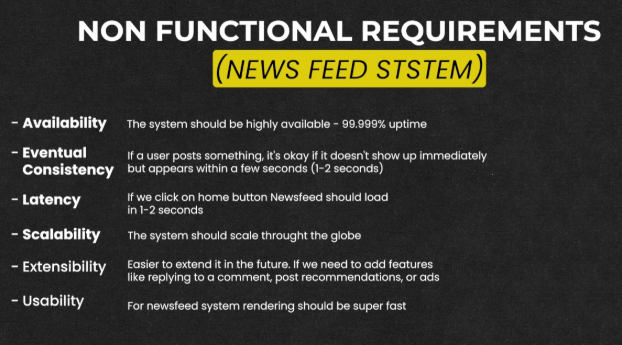

# **📰 News Feed System Requirements**

This document outlines the functional and non-functional requirements for a news feed system, similar to those found on popular social media platforms.

---

## **✨ Functional Requirements**

![!\[\]](img/01.png)

1. **📝 Creating Social Media Posts**  
   Users can create posts with various content types:
    - **📄 Text**
    - **🖼️ Images**
    - **🎥 Videos**

2. **👥 Following/Unfollowing Users**
    - Users can **➕ follow** other users to see their content.
    - Users can **➖ unfollow** users to stop seeing their content.

3. **📰 Newsfeed Display**  
   Users have a **🎯 personalized news feed**:
    - The feed displays posts from **👥 followed users**.
    - Posts are displayed in **⏳ reverse chronological order** (newest to oldest).

4. **💬 Post Interactions**
    - Users can **❤️ like** posts.
    - Users can **💬 comment** on posts.

5. **🔔 User Notifications**
    - Users receive notifications when:
        - Another user **❤️ likes** their post.
        - Another user **💬 comments** on their post.

---

## **⚙️ Non-Functional Requirements**

### **🚀 Performance and Scalability**

1. **🕒 Availability**
    - The system should be **🔝 highly available**, aiming for **99.999% uptime**.

2. **🔄 Eventual Consistency**
    - The system should ensure **⚖️ eventual consistency** to balance performance with accuracy for distributed components.

3. **📈 Scalability**
    - The system must **🌐 scale horizontally** to support a growing number of users and posts.

4. **⏱️ Latency**
    - If we click on the **🏠 home button**, the Newsfeed should load in **1-2 seconds**.

5. **🔧 Extensibility**
    - Easier to **➕ extend** in the future. For example:
        - Adding features like **↩️ replying to a comment**,
        - **📊 post recommendations**, or
        - **📢 ads**.

6. **🎯 Usability**
    - For the NewsFeed system, **⚡ rendering should be super fast**.

---

### 🔙 [Back](../README.md)