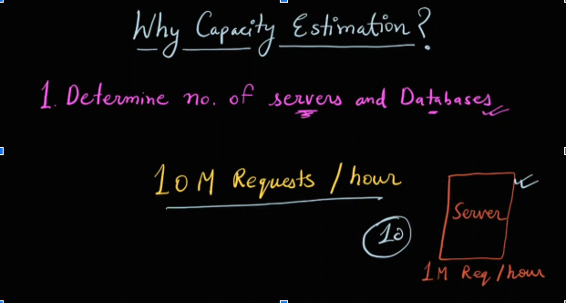
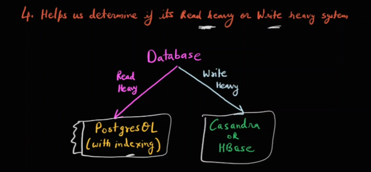

# **Why Capacity Estimation Matters in System Design**

Capacity estimation is a critical step in system design, and this document explains the key reasons why it's essential during system design interviews.

---

## **Benefits of Capacity Estimation**

1. **Resource Allocation**  

   
   
   * Accurate capacity estimation helps determine the number of servers, databases, and other hardware components required to support the system's needs.  
   * ***Example**:* If a server handles 1 million requests per hour and you anticipate 10 million requests per hour, you'll need 10 servers.

2. **Cost Management**  
   
   

   * Capacity estimation prevents overprovisioning or underprovisioning of resources, leading to cost savings by avoiding wasted resources or performance bottlenecks.

3. **Hardware Selection**  
     
     

   * Capacity needs to inform the choice of hardware types and specifications.  
   * ***Example**:* If a system requires 10 million queries per hour, and SQL databases can only handle 50k queries per hour while NoSQL databases handle 1 million, the NoSQL database is the more suitable choice.

4. **Read/Write Load Balancing**

   
   
   * Capacity estimation, specifically throughput analysis, helps determine if a system is read-heavy or write-heavy.  
   * This knowledge influences database selection and optimization strategies.  
   * ***Example:*** A system with 80% reads and 20% writes may require a caching layer to optimize read performance.

---
### 🔙 [Back](../README.md)
