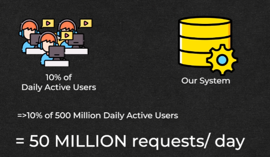

# **Throughput Estimation**

This section estimates the read and write throughput for the news feed system, considering how users interact with the platform.

---

## **Write Throughput**

## Identifying Write Operations

* **Creating posts (text, image, video)**

  

* **Following/unfollowing users**

  

* **Liking/commenting on posts**
  
  

* **Focusing on the Heaviest Write Operation** 

  

  
  * Creating posts is considered the heaviest due to the potential size of data (text, images, videos).  
      
      
* **Estimating Post Creation Frequency**  
    
    

  * Assuming 10% of daily active users (DAU) create a post daily.  
  * With 500 million DAU, this translates to 50 million post creation requests per day.  
  
  * **Write Throughput**

    * 50 million requests per day
---

## **Read Throughput**

* **Primary Read Operation**  
  * Viewing the newsfeed.  

* **Estimating Newsfeed Usage**  
  * Assuming a user opens their newsfeed 10 times a day.  
  * Each time, the user views 10 posts.  
  * This results in 100 posts read per user per day.  

* **Calculating Total Read Requests**
* 
  

* With 500 million DAU, the total read requests are:  
  * 500 million × 100 \= 50 billion read requests per day.

---
### 🔙 [Back](../README.md)