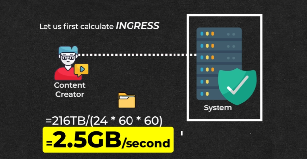
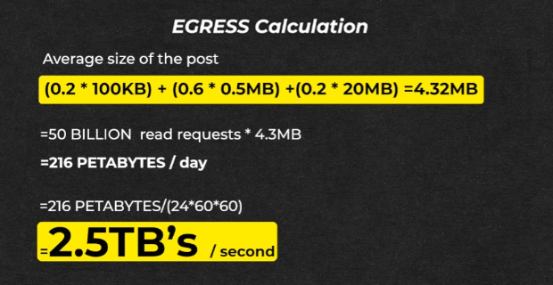

# **🌐 Network Bandwidth Estimation**

This section estimates the network bandwidth required for the news feed system, considering both incoming (ingress) and outgoing (egress) data flow.

---

## **📥 Ingress (Incoming Data)**

- **📅 Daily Ingress**
    - Since all incoming data is eventually stored, the daily ingress is equal to the daily storage: **216 TB**.

- **⏱️ Ingress per Second**
    - Daily ingress divided by the number of seconds in a day:
        - **216 TB / (24 hours/day × 60 minutes/hour × 60 seconds/minute) = 2.5 GB/second**

---

## **📤 Egress (Outgoing Data)**

### **📊 Calculating Daily Egress**

- Outgoing data consists of data read by users (primarily from viewing newsfeeds).
- Total daily egress is calculated by multiplying the number of read requests by the average post size.

### **📏 Average Post Size Calculation**

- Weighted average based on post type percentages and their respective sizes:
    - **0.2 × 100 KB**: 20% are text posts with an average size of 100 KB.
    - **0.6 × 0.5 MB**: 60% are image posts with an average size of 0.5 MB.
    - **0.2 × 20 MB**: 20% are video posts with an average size of 20 MB.
    - This results in an average post size of **4.32 MB**, calculated as follows:
        - **(0.2 × 100 KB) + (0.6 × 0.5 MB) + (0.2 × 20 MB) = 4.32 MB**

### **📅 Daily Egress**
- **50 billion read requests/day × 4.32 MB/request = 216 PB/day**

### **⏱️ Egress per Second**
- Daily egress divided by the number of seconds in a day:
    - **216 PB / (24 hours/day × 60 minutes/hour × 60 seconds/minute) = 2.5 TB/second**

---

## **📝 Summary**

- **📥 Ingress:** `2.5 GB/second`
- **📤 Egress:** `2.5 TB/second`

---
### 🔙 [Back](../README.md)