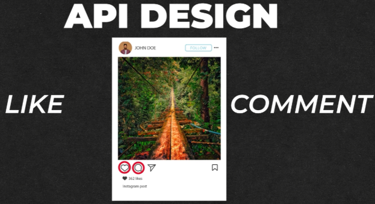
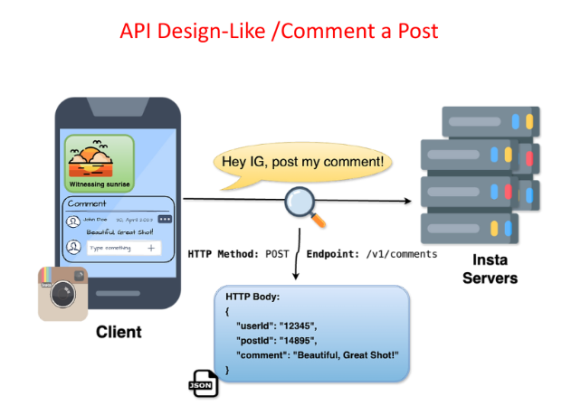

# **API Design for Liking and Commenting on a Post**

This section outlines the API design for liking and commenting on a post in the news feed system. It focuses on the structure and components of the API requests for both actions.



---


## **Liking a Post**



### **Step 1: Choose the HTTP Method**

* Use the **`POST`** method to add a like to a post.

### **Step 2: Define the Endpoint**

* The endpoint for liking a post is **`/v1/likes`**.

### **Step 3: Construct the Request Body**

The request body includes:

* **`user_id`**: Identifies the user liking the post.  
* **`post_id`**: Identifies the post being liked.

---

## **Example API Request for Liking a Post**

`POST /v1/likes`

```
{  
  "user\_id": "12345",  
  "post\_id": "67890"  
}
```

---

## **Commenting on a Post**

### **Step 1: Choose the HTTP Method**

* Use the **`POST`** method to add a comment to a post.

### **Step 2: Define the Endpoint**

* The endpoint for commenting on a post is **`/v1/comments`**.

### **Step 3: Construct the Request Body**

The request body includes:

* **`user_id`**: Identifies the user adding the comment.  
* **`post_id`**: Identifies the post being commented on.  
* **`comment`**: The content of the comment.

---

## **Example API Request for Commenting on a Post**

`POST /v1/comments` 

```
{  
  "user\_id": "12345",  
  "post\_id": "67890",  
  "comment": "This is an example comment."  
}
```
---

[back](../README.md)