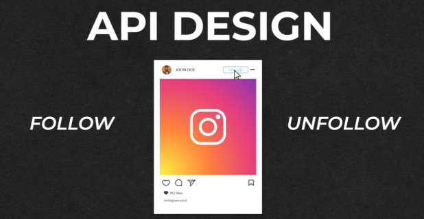

# **API Design for Following and Unfollowing a User**

This section outlines the API design for following and unfollowing another user in the news feed system. It focuses on the structure and components of the API requests for both actions.



---

## **Following a User**


### **Step 1: Choose the HTTP Method**

* Use the **`POST`** method because we are creating a new follow relationship on the server.

### **Step 2: Define the Endpoint**

* The endpoint for following a user is:  
   **`/v1/follow`**

### **Step 3: Construct the Request Body**

* The request body includes:  
  * **`follower_id`**: The ID of the user who is initiating the follow action.  
  * **`followee_id`**: The ID of the user being followed.

---

### **Example API Request for Following a User**

`POST /v1/follow`

```
{  
  "follower\_id": "12345",  
  "followee\_id": "67890"  
}
```

---

## **Unfollowing a User**

### **Step 1: Choose the HTTP Method**

* Use the **`DELETE`** method because we are removing an existing follow relationship on the server.

### **Step 2: Define the Endpoint**

* The endpoint for unfollowing a user is:  
   **`/v1/follow/{follower_id}/{followee_id}`**  
  * **`{follower_id}`**: The ID of the user initiating the unfollow action.  
  * **`{followee_id}`**: The ID of the user being unfollowed.

### **Step 3: Request Body (Not Applicable)**

* **`DELETE`** requests typically do not require a request body, as the required information is included in the URL.

---

### **Example API Request for Unfollowing a User**

`DELETE /v1/follow/12345/67890`

---

This design ensures clarity and simplicity while maintaining RESTful API principles.

---
### 🔙 [Back](../README.md)

