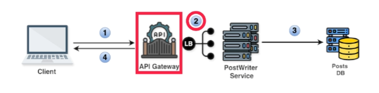
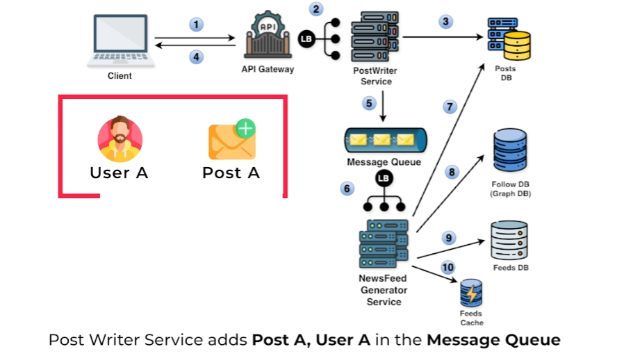
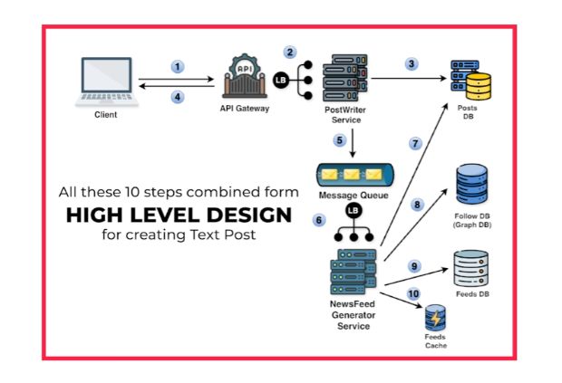

# **High-Level Design for Creating a Text Post (Optimized)**

This section outlines the optimized high-level design for creating a text post and generating news feeds in the news feed system. This design addresses the performance bottleneck identified in the previous approach.

---

## **System Components and Flow**

The following steps describe the enhanced system behavior when a user creates a text post:

### **Step 1: Client Submits Post**

* The user writes a text post and clicks "submit."  
* A **`POST`** request is sent to the API gateway, containing the post details, such as `user_id`, `text`, and `hashtags`.
 

### **Step 2: API Gateway Routing**

* The API gateway receives the request.  
* It routes the request to the Post Writer service via a load balancer.

### **Step 3: Post Writer Service**

* The Post Writer service receives the request.  
* It saves the new post data into the Posts Database, ensuring the operation is transactional to avoid data inconsistencies.

### **Step 4: Confirmation**

* After successfully saving the post, the Post Writer service sends a confirmation response back to the client through the API gateway, indicating success.

### **Step 5: Post Event to Message Queue**

* The Post Writer service publishes an event to the message queue.  
* The event contains metadata, including the `post_id`, `user_id`, `timestamp`, and `hashtags`.

### **Step 6: News Feed Generator Service**

* The News Feed Generator Service consumes the event from the message queue.  
* It identifies followers of the `user_id` and updates their personalized news feeds in the News Feed Database.

---

## **Optimizations and Improvements**

1. **Asynchronous Feed Updates:**

   * By decoupling feed updates from the post creation process using a message queue, the client experiences reduced latency during post submission.  
2. **Scalable Architecture:**

   * The Post Writer service and News Feed Generator Service can scale independently based on the load, ensuring high availability and performance.  
3. **Real-Time Updates:**

   * Followers’ feeds are updated in near real-time, ensuring they see the latest content without significant delay.

---

This optimized design ensures a seamless user experience while maintaining scalability and performance under high traffic.

---
[back](../README.md)