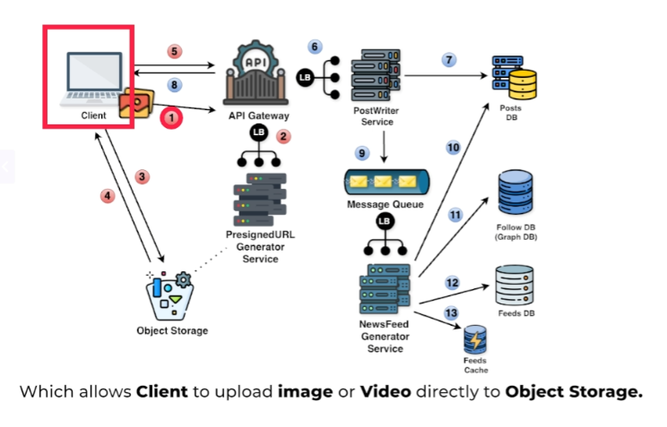
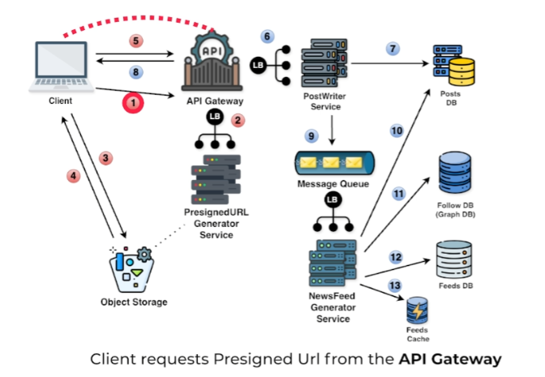
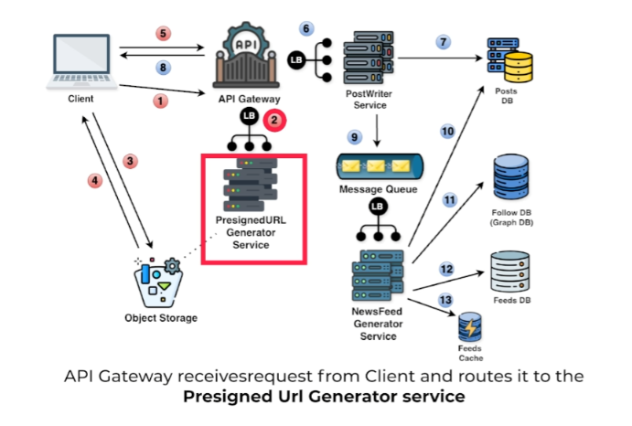
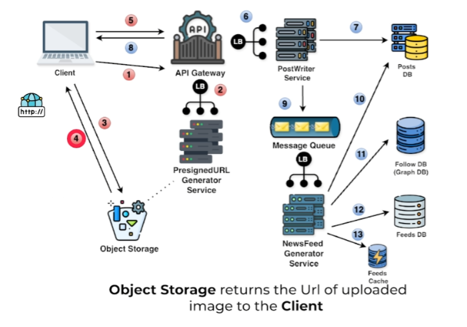
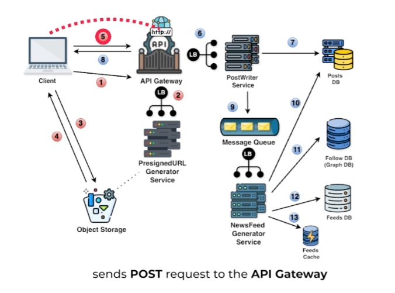

# **High-Level Design for Creating an Image/Video Post**

This section outlines the high-level design for creating an image or video post in the news feed system, focusing on efficient handling of media files.


---


## **System Components and Flow**


The following steps describe how the system handles the creation of an image/video post:

### **Step 1: Request Pre-signed URL**



* The client requests a pre-signed URL from the API gateway to upload the media file.

### **Step 2: API Gateway Routing**



* The API gateway routes the request to the Pre-signed URL Generator service via a load balancer.

### **Step 3: Generate Pre-signed URL**



* The Pre-signed URL Generator service creates a special URL that allows the client to securely upload the media file directly to the object storage.

### **Step 4: Upload to Object Storage**


* The client uses the pre-signed URL to upload the image or video directly to the object storage.

### **Step 5: Receive Media URL**



* The object storage returns the URL of the uploaded media file to the client.

### **Step 6: Submit Post with Media URL**



* The client sends a **`POST`** request to the API gateway, including the media URL in the request body.  
* The request also includes the user ID, description, and any associated hashtags.
 

### **Step 7: API Gateway Routing to Post Service**


* The API gateway forwards the request to the Post Service.

### **Step 8: Store Post Data**


* The Post Service stores the post metadata, including the media URL, in the database.

### **Step 9: Confirmation to Client**


* Once the post is successfully stored, the server sends a confirmation response back to the client.

---

## **Object Storage Role**

* **Purpose:**

  * Handles large media files efficiently and ensures scalability.  
* **Key Features:**

  * **Secure Uploads:** Pre-signed URLs prevent unauthorized access.  
  * **Scalability:** Supports high throughput for upload and retrieval.

---

## **Example Workflow for Creating an Image/Video Post**

1. **Client Request Pre-signed URL:**  
   * Request: `GET /v1/media/presigned-url`  
2. **Upload Media File:**  
   * Use the pre-signed URL to upload the file directly to object storage.  
3. **Submit Post Request:**  
   * Request:

`POST /v1/posts`

```
{  
  "user\_id": "12345",  
  "description": "Check out this cool video\!",  
  "hashtags": \["\#fun", "\#video"\],  
  "media\_url": "https://storage.example.com/uploads/67890.mp4"  
}
```

---

This design ensures efficient handling of media uploads, reduces server load, and optimizes user experience.

---

[back](../README.md)