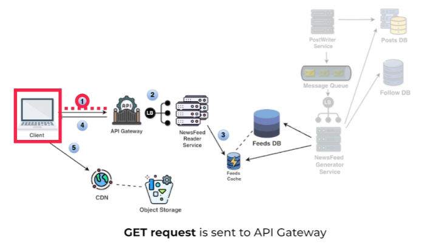
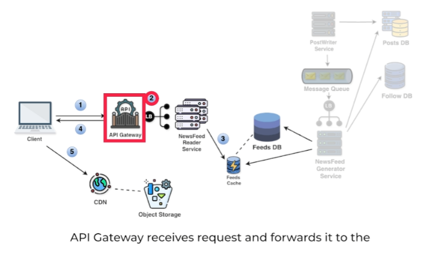
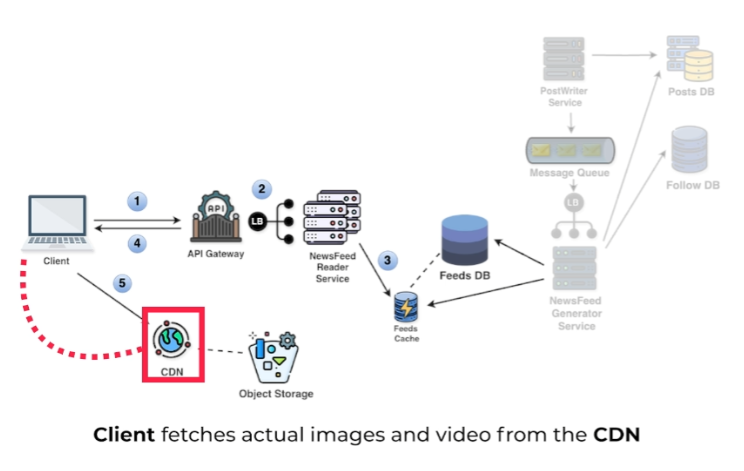

# **📊 High-Level Design for Reading the News Feed**

This section outlines the high-level design for reading the news feed, focusing on efficient retrieval and display of posts.

---

## **🛠️ System Components and Flow**

The following steps describe how the system handles a user's request to view their news feed:

### **Step 1: Client Requests News Feed**

- The client sends a **📥 `GET`** request to the API gateway, targeting the **📍 `/v1/feed/{user_id}`** endpoint.
- This request is made to retrieve the latest news feed for the user.

### **Step 2: API Gateway Routing**

- The API gateway receives the request and forwards it to the **📰 Newsfeed Reader Service** via a load balancer.
- This ensures that the request is routed efficiently, even under heavy load.

### **Step 3: Fetch News Feed from Cache**

- The Newsfeed Reader Service retrieves the pre-built news feed for the user from the **🧠 Feeds Cache**.
- The cache contains recent posts, including text, images, and video URLs, and is populated during post creation.

### **Step 4: Return News Feed with Media URLs**

- The Newsfeed Reader Service sends the news feed data back to the client.
- The news feed contains **🌐 URLs** pointing to images and videos stored in the **☁️ Object Storage** or **🌍 CDN (Content Delivery Network)**. These URLs point to media content without the actual files being included.

### **Step 5: Fetch Media from CDN/Object Storage**

- The client uses the media URLs provided in the news feed to fetch the actual image and video content from the **🌍 CDN**.
- If the content is not found in the CDN (e.g., if it's not cached), the client retrieves it directly from the **☁️ Object Storage**.

### **Step 6: Display News Feed**
- The client displays the complete news feed to the user, including **📝 text**, **🖼️ images**, and **🎥 videos**.
- The text content is typically loaded first, while media content (images, videos) is loaded separately based on its availability.

---

## **🕒 Explanation of Delayed Media Loading**

The reason why images and videos sometimes load after the text in a news feed is that the client needs to make separate requests to fetch the media files from the **🌍 CDN** or **☁️ Object Storage**. This may introduce a slight delay in the display of media content, especially if the files are not cached or are stored in a remote location.

---

## **🚀 Benefits of Pre-built News Feeds and CDNs**

- **⏱️ Reduced Latency:** Pre-built news feeds stored in the cache allow for quick retrieval and display, reducing wait times for the user.
- **⚡ Improved Performance:** CDNs distribute media content closer to users, reducing loading times and improving the user experience.
- **📈 Scalability:** Caching and CDNs efficiently handle a large number of users and requests, ensuring that the system can scale without significant performance degradation.

---

**This design optimizes the reading experience by leveraging 🧠 caching and 🌍 CDNs, reducing response times and ensuring a smooth display of content for users.**

---
### 🔙 [Back](../README.md)