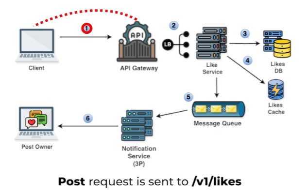
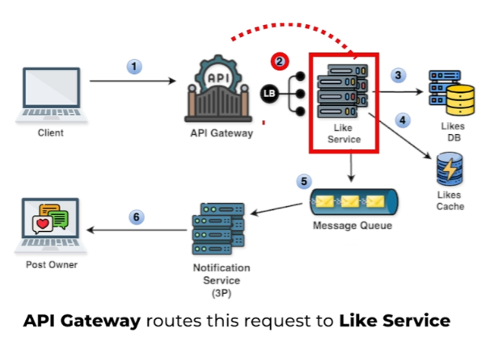
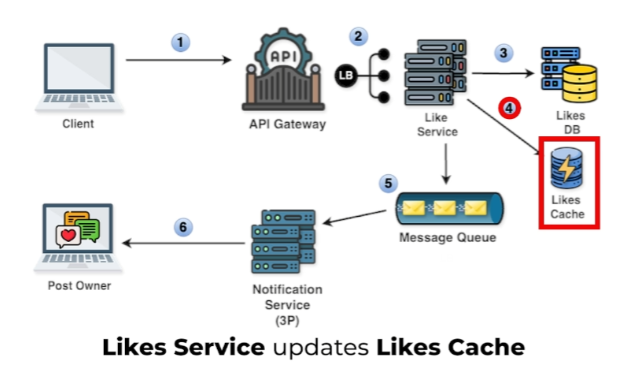
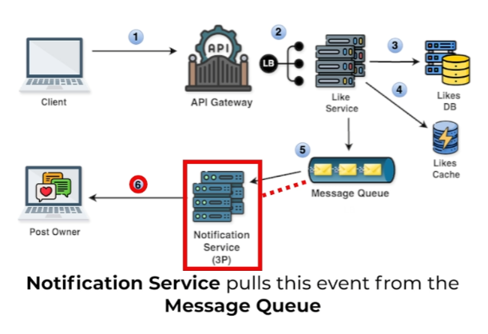

# **High-Level Design for Liking a Post**

This section outlines the high-level design for the liking functionality in the news feed system, including the notification mechanism and integration with the news feed display. It also highlights the importance of the **Likes Cache** for efficient like count retrieval.

---

## **System Components and Flow**

The following steps describe how the system handles a user liking a post:

### **Step 1: Client Submits Like**

* The user clicks the like button.  
* A **`POST`** request is sent to the API gateway, targeting the `/v1/likes` endpoint.  
* The request includes the `user_id` (who liked the post) and `post_id` (the post being liked).

### **Step 2: API Gateway Routing**

* The API gateway receives the request and routes it to the **Like service** via a load balancer.  
* The gateway ensures the request reaches the appropriate service for processing.

### **Step 3: Like Service Processing**

* The **Like service** processes the like request and stores it in the **Likes Database**.  
* The database keeps track of each like, associating it with the user and the post.

### **Step 4: Update Likes Cache**

* To speed up access, the **Like service** updates the **Likes Cache**.  
* The cache stores a mapping between `post_id` and its corresponding `likes_count`. This allows for quick retrieval of like counts.

### **Step 5: Add Event to Message Queue**

* The **Like service** adds an event to the **message queue**, containing the `user_id` (who liked the post) and `post_id`.  
* This event triggers the **Notification service** to notify the post owner about the new like.

### **Step 6: Notification Service**

* The **Notification service** (a third-party service) pulls the event from the message queue.  
* It uses the event data to identify the post owner and send them a notification about the new like.

### **Step 7: Post Owner Notification**

* The post owner receives the notification and is happy about the new like.  
* This ensures the post owner stays engaged with interactions on their content.

---

## **Integration with News Feed**

To display the correct like count in the news feed, the following step is added to the news feed retrieval process:

### **Step 3B: Fetch Like Count from Cache**

* The **Newsfeed Reader service** retrieves the like count for each post from the **Likes Cache**.  
* This ensures the like count is displayed quickly without querying the database every time the news feed is loaded.

---

## **Importance of the Likes Cache**

The **Likes Cache** plays a crucial role in optimizing the display of like counts. Here's why:

* **Efficiency:** The cache provides very fast access to like counts, avoiding querying the database for every news feed request.  
* **Scalability:** By reducing database load, the cache helps the system handle a large number of users and requests efficiently.  
* **Improved User Experience:** Users see accurate like counts in their news feed without experiencing delays or performance issues.

---

### **Example:**

Imagine a scenario with millions of users and posts. Without the **Likes Cache**, the system would need to query the database every time a user views their news feed to retrieve the like count for each post. This would significantly impact performance and scalability. The **Likes Cache** solves this problem by storing the like counts in memory, allowing for quick and efficient retrieval.

---

This design ensures that likes are processed efficiently, notifications are delivered in a timely manner, and users can view accurate like counts with minimal impact on system performance.

---

### 🔙 [Back](../README.md)
