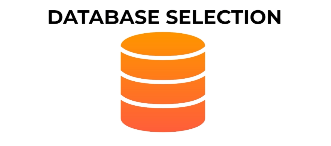
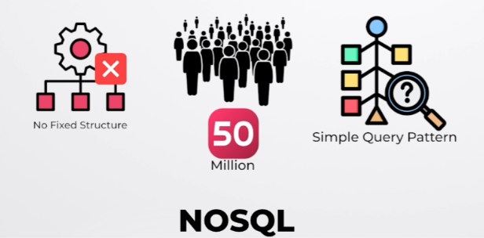
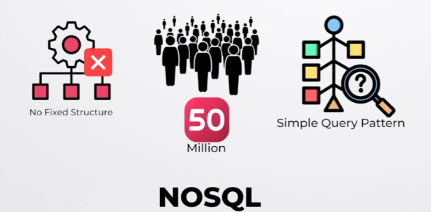

# **📊 Deep Dive: Database Selection**

This section dives deep into the database selection process for the news feed system. It provides guidelines for choosing between SQL and NoSQL databases and applies these guidelines to select the appropriate database type for each component of the system.

---

## **📝 General Guidelines for Database Selection**

While the specific needs of a project ultimately dictate the best database choice, the following guidelines can help in the decision-making process:

- **⚡ Fast Data Access:** NoSQL databases generally offer faster data access than SQL databases, making them suitable for applications requiring low latency.
- **📈 Large Scale:** NoSQL databases tend to perform better at scale, handling large volumes of data and high throughput more efficiently than SQL databases.
- **📐 Fixed Data Structure:** SQL databases are well-suited for data that fits into a predefined schema with relationships between tables.
- **🛠️ Flexible Data Structure:** NoSQL databases are a better choice when the data structure is not fixed or may evolve over time.
- **🧩 Complex Queries:** SQL databases excel at handling complex queries involving joins and aggregations.
- **🔍 Simple Queries:** NoSQL databases are efficient for simple queries, such as retrieving data by ID.
- **🔄 Frequent Data Changes:** NoSQL databases, with their flexible schema, are better equipped to handle frequent data changes and evolving data models.

---

## **🗂️ Database Selection for News Feed Components**

Based on the above guidelines and the characteristics of each component in the news feed system, the following database choices are made:

### **📄 Posts Database (Posts DB)**

- **Characteristics:**
    - Unstructured data (text, images, videos, metadata)
    - High scale (50 million posts per day)
    - Simple query pattern (retrieving posts by ID)

- **Choice:** **NoSQL database**  
  A NoSQL database is a better fit due to its ability to handle unstructured data and high-scale environments efficiently.

### **📰 Feeds Database (Feeds DB)**

- **Characteristics:**
    - Unstructured data (mapping between user ID and news feed)
    - High scale (50 million posts per day)
    - Simple query pattern (reading news feed by user ID)

- **Choice:** **NoSQL database**  
  NoSQL is suitable due to the unstructured nature of the data and the need for high scalability.

### **💬 Comments Database (Comments DB)**

- **Characteristics:**
    - High scale (1.5 billion activities per day)
    - No fixed schema (potential for evolving data model with nested comments)
    - Simple query pattern (finding comments for a post)

- **Choice:** **NoSQL database**  
  NoSQL is ideal for the evolving data structure and high-scale requirements.

### **❤️ Likes Database (Likes DB)**

- **Characteristics:**
    - High scale (1.5 billion activities per day)
    - No fixed schema (potential for different reaction types in the future)
    - Simple query pattern (calculating like counts, finding users who liked a post)

- **Choice:** **NoSQL database**  
  NoSQL fits well due to the high activity volume, flexibility for future reactions, and simple query requirements.

### **👥 Follower Database (Follower DB)**

- **Characteristics:**
    - Stores user connections and relationships
    - Needs to efficiently find followers and followees for a user
    - Large scale to handle millions of users and their relationships

- **Choice:** **Graph database**  
  A graph database is the best fit for storing and querying relationship-based data such as user connections in a social network.

---

### 🔙 [Back](../README.md)