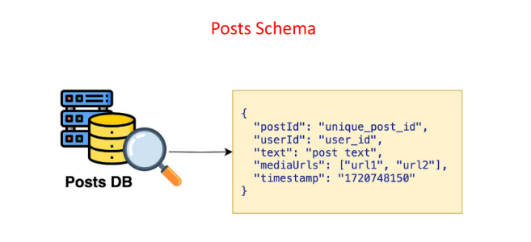
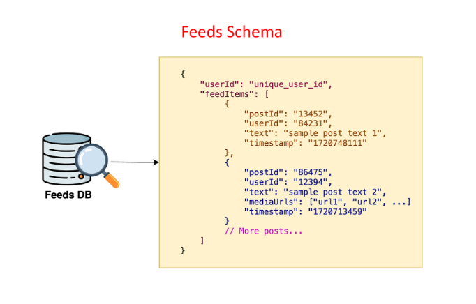
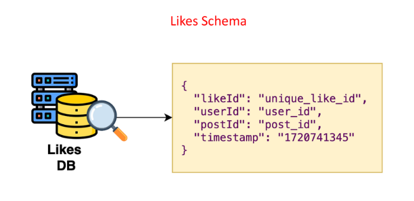
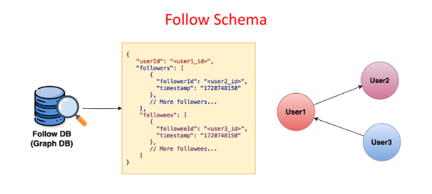

# **Deep Dive: Data Modeling**

This section details the data modeling for the various databases used in the news feed system. It outlines the schema and indexing strategies for each database.

---

## **Posts Database (Posts DB)**

* **Schema:**

  * `post_id`: Unique identifier for the post.  
  * `user_id`: ID of the user who created the post.  
  * `text`: Text content of the post.  
  * `media_urls`: List of URLs pointing to media files (images, videos) in object storage.  
  * `timestamp`: Time when the post was created.  
* **Indexing:**

  * Index on `post_id` to efficiently retrieve posts by their ID.

---

## **Feeds Database (Feeds DB)**

* **Schema:**

  * `user_id`: ID of the user.  
  * `feed_items`: List of posts in the user's news feed. Each post is represented by its `post_id` and other relevant information.  
* **Indexing:**

  * Index on `user_id` to efficiently retrieve a user's news feed.

---

## **Comments Database (Comments DB)**

* **Schema:**

  * `comment_id`: Unique identifier for the comment.  
  * `user_id`: ID of the user who created the comment.  
  * `post_id`: ID of the post the comment belongs to.  
  * `comment`: Text content of the comment.  
  * `timestamp`: Time when the comment was created.  
* **Indexing:**

  * Index on `post_id` to efficiently retrieve all comments for a specific post.

---

## **Likes Database (Likes DB)**

* **Schema:**

  * `like_id`: Unique identifier for the like.  
  * `user_id`: ID of the user who liked the post.  
  * `post_id`: ID of the post that was liked.  
  * `timestamp`: Time when the like was recorded.  
* **Indexing:**

  * Index on `post_id` to efficiently:  
    * Calculate the number of likes for a post.  
    * Find all users who liked a particular post.

---

## **Follower Database (Follower DB)**

* **Schema:**

  * `user_id`: ID of the user.  
  * `followers`: List of users who follow this user, including their `user_id` and the `timestamp` when they followed.  
  * `followees`: List of users this user follows, including their `user_id` and the `timestamp` when the follow relationship was established.  
* **Indexing:**

  * Index on `user_id` to efficiently retrieve both followers and followees for a user.

---

### 🔙 [Back](../README.md)