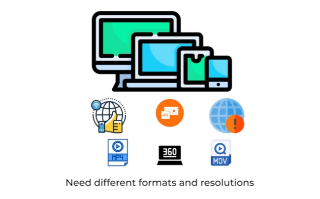

# **Deep Dive: Media Processing**

This section explores the media processing aspect of the news feed system, focusing on how different formats and resolutions are handled to cater to various devices and network conditions.

---

## **The Need for Media Processing**

When users upload images or videos, the system needs to ensure that these media files can be accessed and viewed seamlessly across different devices (e.g., mobile phones, laptops) and under varying internet speeds. This requires storing the media in multiple formats and resolutions.

* **Different Devices:** Different devices may support different media formats. For example, mobile phones might prefer MP4 for videos, while laptops might work better with MOV format.  
* **Varying Internet Speeds:** Users with faster internet connections can handle higher resolution media (e.g., 4K), while those with slower connections require lower resolutions (e.g., 360p or 240p) for smooth playback.

---

## **Media Processing Workflow**

To address these requirements, the system incorporates a media processing service:

1. **Upload to Object Storage:**

   * When a user uploads a media file, it is initially stored in the object storage.  
2. **Media Processing Service:**

   * The media processing service takes the uploaded file and converts it into multiple formats (e.g., MP4, MOV) and resolutions (e.g., 4K, 1080p, 720p, 360p).  
3. **Store Processed Media:**

   * The processed media files, in various formats and resolutions, are stored back in the object storage.  
4. **Deliver Optimized Media:**

   * When a user requests to view the media, the system identifies the user's device and network conditions.  
   * Based on these factors, the appropriate format and resolution are selected and delivered to the user.

---

## **Benefits of Media Processing**

* **Enhanced User Experience:** Users receive the optimal media format and resolution for their device and network conditions, ensuring smooth playback and a positive viewing experience.  
* **Reduced Bandwidth Consumption:** Delivering lower resolution media to users with slower connections saves bandwidth and improves loading times.  
* **Wider Device Compatibility:** Supporting multiple formats ensures that the media can be accessed from a wider range of devices.

---

[back](../README.md)