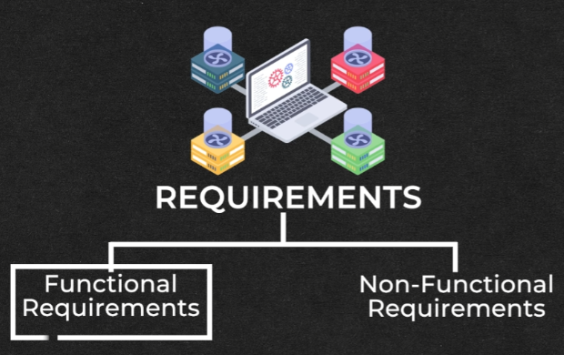
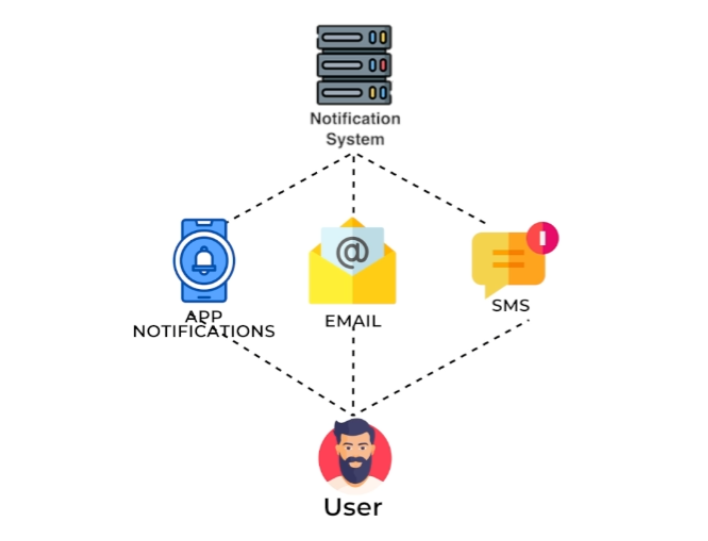
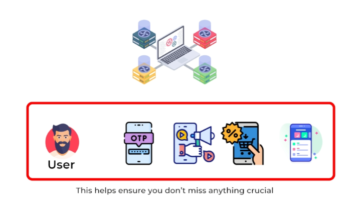

# **Functional Requirements for a Notification System**

## **1\. Key Concepts**

### **Clients**

Applications or services that send notifications (e.g., social media apps, online stores).

### **Users**

Individuals who receive notifications on their devices.

---

## **2\. Functional Requirements**

### **1\. Send Notifications**

* **Requirement**: The system must enable clients to send notifications to users.  
* **Delivery Channels**: Notifications should be delivered through multiple channels: SMS, email, and in-app notifications.  
* **Rationale**: Multi-channel delivery ensures users receive messages in the formats they prefer and are most likely to engage with.

### **2\. Rate Limiting**

* **Requirement**: The system must control the rate of notification delivery to prevent users from being overwhelmed.  
* **Benefits**:  
  * Prevents notification overload and spam.  
  * Manages server load during peak traffic.

### **3\. Prioritization and Validation**

* **Requirement**: The system should prioritize critical notifications (e.g., OTPs) over less urgent ones (e.g., promotional messages).  
* **Validation**: The system must validate notification content and the recipient’s identity before sending.  
* **Benefits**:  
  * Ensures timely delivery of critical alerts.  
  * Enhances security and prevents unauthorized notifications.

### **4\. User Preferences**

* **Requirement**: The system must respect user preferences regarding notification frequency, types, and channels.  
* **Benefits**:  
  * Creates a user-centric experience.  
  * Reduces unnecessary interruptions.  
  * Gives users control over their notification experience.
  
---

## **3\. Conclusion**

These functional requirements form the foundation of a well-designed notification system. By addressing these requirements, the system can effectively deliver information to users while respecting their preferences and ensuring a positive experience.

---

### 🔙 [Back](../README.md)

