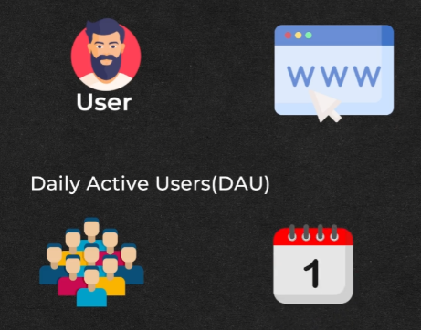

# **Capacity Planning for a Notification System**

This document dives deep into the capacity planning process for a notification system, emphasizing the crucial role of estimating Daily Active Users (DAU) and Monthly Active Users (MAU).

## **Why Capacity Planning Matters**

Building a scalable notification system requires careful planning to ensure it can handle the expected load without performance hiccups or system crashes, especially during peak usage. Think of it as designing a highway: you need enough lanes to handle rush hour traffic without gridlock.

## **Key Metrics to Consider**

### **1\. Daily Active Users (DAU)**

* **Definition:** The number of unique users interacting with the notification system daily.  
* **Purpose:** Helps in understanding the system's peak daily load.  
* **Example:** If an app has 100,000 DAU, the system must be able to handle notifications for all these users.

### **2\. Monthly Active Users (MAU)**

* **Definition:** The total number of unique users interacting with the notification system over a month.  
* **Purpose:** Provides a broader perspective on system usage trends.  
* **Example:** If the app has 500,000 MAU, it indicates user engagement and retention levels.

--- 

## **Planning for Scalability**

### **Estimating Peak Usage**

* **Why It Matters:** Peak times often occur during promotions or events.  
* **Steps to Estimate:**  
  1. Analyze historical data for spikes in notification volume.  
  2. Identify patterns such as daily or weekly peaks.  
  3. Plan for a buffer above the highest peak to ensure smooth operation.

### **Infrastructure Requirements**

* **Servers:** Ensure the system can handle concurrent connections without delays.  
* **Storage:** Account for logs, message queues, and retry mechanisms.  
* **Bandwidth:** Handle high traffic volumes without latency.

--- 

## **Strategies for Optimization**

### **Load Balancing**

* Distribute traffic across multiple servers to prevent overloading.  
* Use intelligent routing based on server health and proximity to users.

### **Caching**

* Cache frequently used data to reduce database queries and improve response times.

### **Rate Limiting**

* Control the flow of notifications to prevent abuse and ensure system stability.

---

## **Monitoring and Scaling**

### **Monitoring Tools**

* Use real-time monitoring to track system performance.  
* Key Metrics:  
  * Latency  
  * Error rates  
  * Throughput

### **Scaling Strategies**

* **Vertical Scaling:** Increase server capacity (e.g., CPU, memory).  
* **Horizontal Scaling:** Add more servers to the system.  
* **Auto-Scaling:** Automatically adjust resources based on real-time demand.
---

## **Conclusion**

Effective capacity planning ensures that a notification system can meet user demands reliably, even during peak periods. By understanding usage patterns, optimizing infrastructure, and employing robust scaling strategies, organizations can deliver seamless notification experiences while minimizing operational risks.

---

### 🔙 [Back](../README.md)