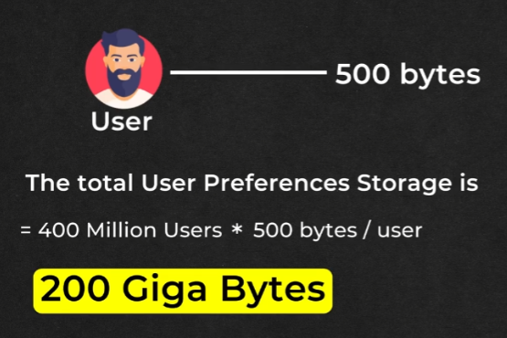
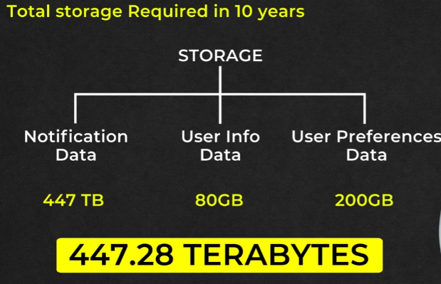

# **Capacity Planning: Storage Estimation**

This document details the storage estimation for a notification system, considering the various types of data that need to be stored and their respective sizes.

## **Types of Data**

The notification system primarily stores three types of data:

1. **Notification Data:** This includes the content and metadata of the notifications themselves.  
2. **User Info Data:** This comprises basic information about the users, such as their preferences, contact details, and notification history.  
3. **System Logs:** These are records of system operations, including successful and failed notifications, system errors, and performance metrics.

## **Factors Affecting Storage Requirements**

1. **Data Retention Policies:**

   * Define how long the system must retain notification data, user info, and logs.  
   * Longer retention policies require more storage capacity.  
2. **Frequency and Volume of Notifications:**

   * The higher the number of notifications sent daily, the greater the storage requirement for logs and metadata.  
3. **Data Compression:**

   * Utilizing compression techniques can significantly reduce storage requirements.  
4. **Archival Strategies:**

   * Storing older data in less expensive, slower-access storage can optimize storage costs.  

## **Estimation Methodology**

1. **Determine Data Sizes:**

   * Calculate the average size of each notification, user record, and log entry.  
2. **Estimate Daily Data Volume:**

   * Multiply the average sizes by the expected daily volume of notifications, user interactions, and system events.  
3. **Apply Retention Policies:**

   * Multiply the daily data volume by the retention period to determine total storage needs.  
4. **Include Growth Factors:**

   * Account for user base growth and increasing notification volumes over time.  
5. **Factor in Redundancy:**

   * Add storage overhead for backups and fail-over systems.

## **Example Calculation**

* **Notification Data:**   
  * **SMS (30%)**  
    * 500 bytes   
    * 50 Million \* 0.3 \* 500b  
    * 7.5 GB / day   
  * **EMAIL (40%)**  
    * 5 Kilo Bytes   
    * 50 Million \* 0.4 \* 5KB  
    * 100 GB / day   
  * **PUSH NOTIFICATIONS (30%)**  
    * 1 Kilo Byte  
    * 50 Million \* 0.3 \* 1KB  
    * 15 GB / day  
  * **Result:**	  
    * **122.5GB / day**  
  * **Calculate for 10 years:**  
* **122.5 GB / day \* 365 days \* 10 years**  
* **447 Tera Bytes**

### **User Info Data**

### **User Preferences Data**

--- 

## **Conclusion**

By carefully estimating storage needs based on data types, volumes, and retention policies, a notification system can ensure it has adequate capacity to handle current and future demands.

---

### 🔙 [Back](../README.md)