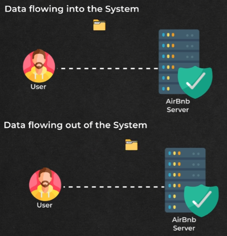

# **Capacity Planning: Network Bandwidth Estimation**

This document explains the estimation of network bandwidth for a notification system, considering both incoming (ingress) and outgoing (egress) data flow.

## **What is Network Bandwidth?**

Network bandwidth refers to the amount of data that can be transferred over a network connection in a given time, typically measured in bits per second (bps) or bytes per second (Bps). In the context of our notification system, it represents the volume of data flowing in and out of the system each second.

---

## **Ingress (Incoming Data)**

Ingress refers to the data flowing into the system. In our case, this primarily consists of the notification data being added to the system by clients.

### **Calculation:**

1. **Daily Ingress:** Based on the storage estimation, the notification data stored per day is 122.5 GB. This represents the total incoming data volume for the day.  
2. **Ingress per Second:** To calculate the ingress per second, we divide the daily ingress by the number of seconds in a day:  
   `122.5 GB / (24 hours/day * 60 minutes/hour * 60 seconds/minute)` ≈ **1.42 MB/second**.

## **Egress (Outgoing Data)**

Egress refers to the data flowing out of the system. This includes the notifications being delivered to users.

![][image3]

### **Calculation:**

1. **Filtering:** Assuming 15% of notifications are filtered out, only 85% are actually delivered.  
2. **Total Delivered Data:**  
   `122.5 GB/day * 0.85 (85%)` ≈ 104.125 GB/day.  
3. **Egress per Second:** Dividing the total delivered data by the number of seconds in a day gives us the egress per second:  
   `104.125 GB / (24 hours/day * 60 minutes/hour * 60 seconds/minute)` ≈ **1.21 MB/second**.

## **Summary**

* **Ingress:** `1.42 MB/second`  
* **Egress:** `1.21 MB/second`

## **Importance of Bandwidth Estimation**

Accurate bandwidth estimation is crucial for:

* **Network Capacity Planning:** Ensuring the network infrastructure has sufficient capacity to handle the incoming and outgoing data traffic.  
* **Cost Optimization:** Choosing the appropriate network plan and avoiding overspending on unnecessary bandwidth.  
* **Performance Optimization:** Identifying potential bottlenecks and optimizing data transfer to minimize latency and improve notification delivery speed.

By carefully estimating and managing network bandwidth, the notification system can ensure efficient and reliable delivery of notifications to users.

---

### 🔙 [Back](../README.md)

