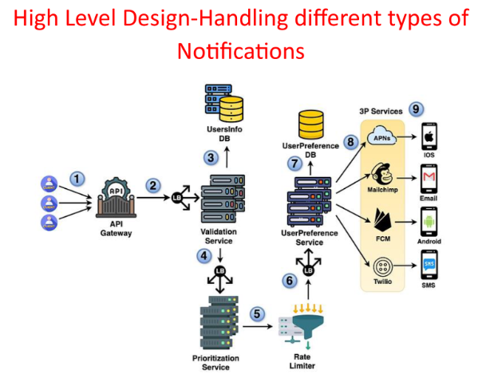

# **High-Level Design: Optimizing with Specialized Notification Senders**

This document outlines the refinement of the notification system's high-level design by introducing specialized notification sender services to enhance efficiency and scalability.

---

## **Decoupling Responsibilities**

In the previous design, the **User Preference Service** performed dual roles:

* Filtering notifications based on user preferences.  
* Routing notifications to delivery services.

This mixed responsibility limited modularity. The new design introduces the **Notification Sender Service**, which exclusively handles notification delivery to target users. This decoupling improves both modularity and maintainability.

---

## **Introducing Specialized Notification Senders**

Initially, a single Notification Sender Service was proposed to handle all notification types. However, this approach had challenges:

1. **Complexity of Protocols**

   * Each notification type (e.g., SMS, email, push) has unique protocols and integration requirements, making centralized management difficult.  
2. **Scalability Limitations**

   * A single service cannot process all notification types simultaneously, creating bottlenecks when demand spikes for specific types.

To overcome these issues, the system now includes **specialized notification sender services**:

* **iOS Notification Sender**: Manages iOS push notifications via APNs.  
* **Android Notification Sender**: Handles Android push notifications via FCM.  
* **SMS Notification Sender**: Sends SMS notifications through Twilio.  
* **Email Notification Sender**: Manages email notifications using Mailchimp.

---
## **Optimized Notification Flow**

The notification flow, incorporating specialized senders, follows these steps:

1. **Client Request**

   * The client sends a notification request to the API Gateway.  
2. **API Gateway Routing**

   * The API Gateway forwards the request to the Validation Service.  
3. **Validation**

   * The Validation Service verifies recipient details.  
4. **Prioritization**

   * The Prioritization Service assigns priority levels to notifications.  
5. **Rate Limiting**

   * The Rate Limiter ensures notifications adhere to frequency restrictions.  
6. **User Preference Filtering**

   * The User Preference Service filters notifications based on user preferences.  
7. **Specialized Sender Routing**

   * Notifications are routed to the corresponding specialized sender service:  
     * iOS Sender (APNs).  
     * Android Sender (FCM).  
     * SMS Sender (Twilio).  
     * Email Sender (Mailchimp).  
8. **Third-Party Service Interaction**

   * Each sender service interacts with its respective third-party delivery platform.  
9. **Delivery**

   * Notifications are delivered to the target users via the selected platform.

---

## **Benefits of Specialized Senders**

1. **Improved Efficiency**

   * Services focus on specific notification types, streamlining delivery and protocol handling.  
2. **Enhanced Scalability**

   * Supports parallel processing of different notification types, addressing varying demands efficiently.  
3. **Simplified Maintenance**

   * Specialized services isolate concerns, facilitating easier updates and system management.

---

This refined design ensures reliable, scalable, and efficient notification delivery, supporting diverse notification types through specialized sender services.

---

### 🔙 [Back](../README.md)