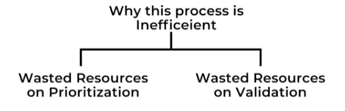
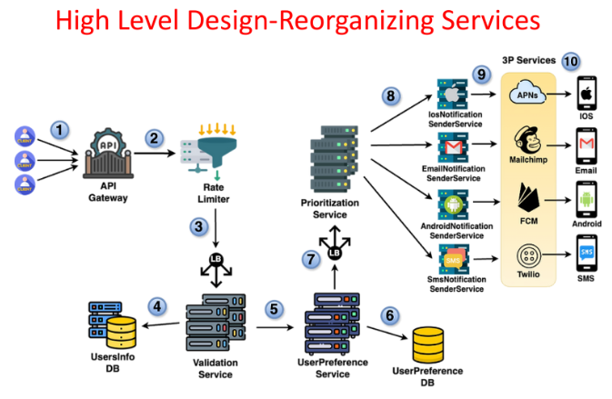

# **📡 High-Level Design: Optimizing Notification Flow**

This document describes further optimizations to the notification system's high-level design, focusing on the order of operations to improve efficiency and resource utilization.

---

## **🔄 Re-evaluating the Notification Flow**

The previous design had the following flow:

* **Prioritization → Rate Limiting → User Preferences**

While seemingly logical, this order has inefficiencies:

1. **💻 Wasted Resources on Prioritization:** Prioritizing all notifications, including those that might be discarded later due to rate limits or user preferences, wastes processing power.
2. **💾 Wasted Resources on Validation:** Validating notifications before rate limiting can lead to unnecessary processing of notifications that will be discarded anyway.

---

## **⚙️ Optimized Order of Operations**

To address these inefficiencies, the order of operations is adjusted:

* **⏳ Rate Limiting First:** By performing rate limiting before other steps, we ensure that only the allowed number of notifications per user are processed further, avoiding unnecessary validation and prioritization.
* **🚦 Prioritization Last:** Prioritization is moved to the end of the flow to avoid wasting resources on notifications that might be filtered out.

---

## **📨 Optimized Notification Flow**

The optimized flow is as follows:

1. **📨 Client Request:** The client sends a notification request to the API gateway.
2. **⏳ Rate Limiting:** The Rate Limiter checks if the user has exceeded their notification quota.
3. **🚫 Rate Limiting Action:**
   * If the quota is exceeded, the request is rejected.
   * If within quota, the request proceeds.
4. **⚙️ User Preferences Validation:** The system checks the user's notification preferences to ensure compatibility.
5. **🔍 Notification Validation:** The notification is validated for correctness and completeness.
6. **🚦 Prioritization:** Notifications are prioritized based on urgency or importance.
7. **📤 Notification Delivery:** The validated and prioritized notifications are sent to the appropriate delivery channels.

---

## **✅ Benefits of the Optimized Flow**

* **💡 Improved Resource Utilization:** By discarding unnecessary notifications early, the system saves processing power and reduces bottlenecks.
* **⚡ Enhanced Efficiency:** Processing fewer notifications leads to faster overall throughput.
* **😊 Better User Experience:** Prioritizing only valid and allowed notifications ensures timely delivery of important messages.

---

### 🔙 [Back](../README.md)