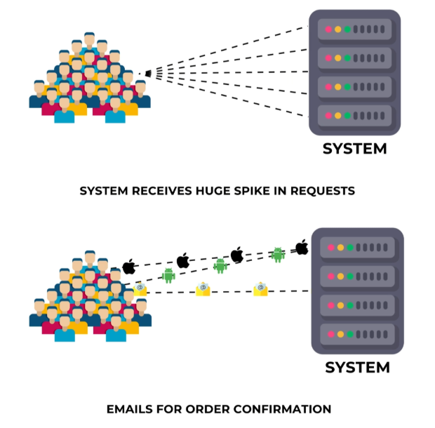
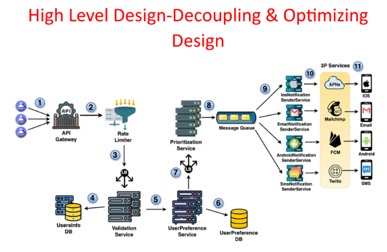

# **High-Level Design: Decoupling with Message Queues**

This document explains how to decouple services in the notification system's design using message queues to improve reliability and fault tolerance.

---
## **Identifying Coupling Issues**

In the previous design, the Prioritization Service directly forwarded notifications to the respective Notification Sender Services. This tight coupling can lead to issues:

* **Processing Burden:** If one sender service slows down or becomes unresponsive, the Prioritization Service gets blocked, reducing overall system throughput.  
* **Failure Recovery:** If a sender service crashes, notifications in transit are lost, with no mechanism for recovery or retry.

---

## **Decoupling with Message Queues**

To address these issues, we introduce **message queues** between the Prioritization Service and the Notification Sender Services. This decouples the services, allowing them to operate independently and improving system resilience.

---
## **Benefits of Message Queues**

* **Reduced Burden on Prioritization Service:** Even if a sender service slows down, the Prioritization Service can continue processing and enqueueing notifications without being blocked.  
* **Retry Mechanism:** If a sender service fails, messages remain in the queue until the service recovers, ensuring no notifications are lost.  
* **Improved Fault Tolerance:** The system becomes more resilient to failures in individual sender services.

---
## **Optimized Notification Flow with Message Queues**

1. **Client Request:** The client sends a notification request to the API gateway.  
2. **Prioritization Service:** The request is processed and prioritized based on business rules.  
3. **Message Queue:** Notifications are enqueued, decoupling the Prioritization Service from the sender services.  
4. **Notification Sender Services:** Each sender service retrieves messages from the queue and processes them for delivery.  
5. **Delivery Channels:** The notifications are sent via appropriate channels like push notifications, SMS, or email.

---

By incorporating message queues, the notification system achieves greater scalability, reliability, and fault tolerance, ensuring seamless delivery even during service disruptions.

---

### 🔙 [Back](../README.md)