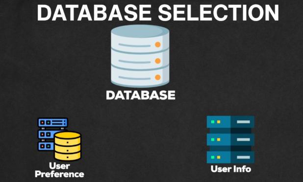

# **Deep Dive: Database Selection**

This section explains the process of selecting appropriate database types for the notification system, considering various factors and guidelines.

---

## **General Guidelines for Database Selection**

Choosing the right database is crucial for system performance and scalability. While project-specific needs ultimately guide the decision, the following general guidelines can help:

* **Fast Data Access:** NoSQL databases are generally preferred when low latency and fast data retrieval are critical.  
* **Large Scale:** NoSQL databases tend to outperform SQL databases when handling very large datasets and high throughput.  
* **Fixed Data Structure:** SQL databases are well-suited for data with a fixed schema and relationships between tables.  
* **Complex Queries:** SQL databases excel at handling complex queries involving joins and aggregations.  
* **Evolving Data:** NoSQL databases are more suitable for data that changes frequently or may evolve over time due to their flexible schema.

---

### **Database Selection for Notification System Components**

#### **1\. User Info Database**

  

* **Factors:**  
  * **Moderate Scale:** The user base is large, but the scale of data in the User Info Database is moderate compared to other parts of the system.  
  * **Fixed Structure:** User information (name, email, phone) has a fixed structure and is unlikely to change significantly.  
* **Choice:** SQL database. It is well-suited for structured data and moderate scale.

---

#### **2\. User Preference Database**

  

* **Factors:**  
  * **Flexible Structure:** User preferences can evolve over time with new notification types and channels, requiring a flexible schema.  
  * **Simple Queries:** Queries are straightforward, mainly fetching preferences by user ID.  
  * **Frequent Changes:** User preferences can change often, requiring an adaptable data structure.  
* **Choice:** NoSQL database. Its flexible schema and ability to handle frequent changes make it a good fit for storing user preferences.

---

### 🔙 [Back](../README.md)