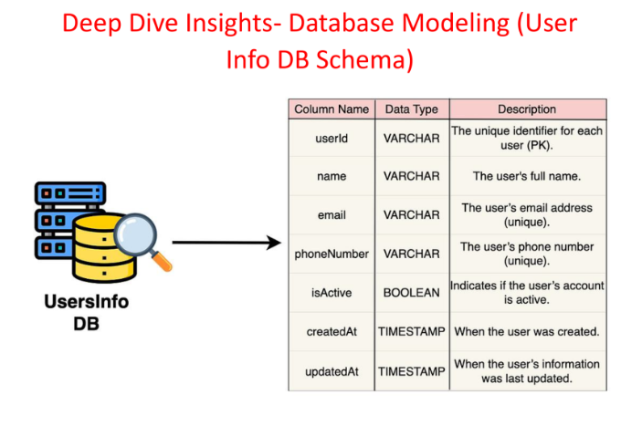
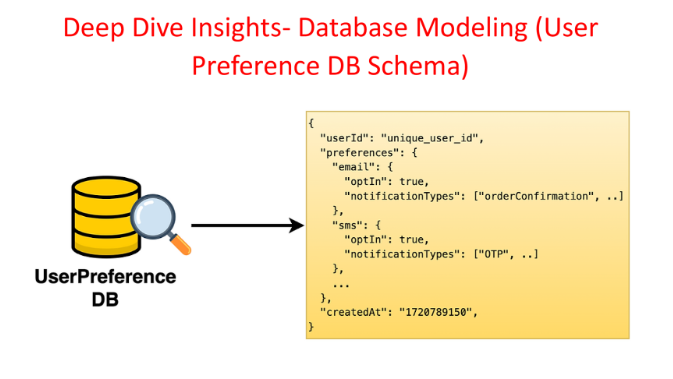

# **Deep Dive: Data Modeling**

This section details the data modeling for the databases used in the notification system, focusing on the structure and organization of data within each database.

---

### **User Info Database Schema**

The User Info Database, being an SQL database, is structured with rows and columns. Each row represents a user, and the columns store different attributes of the user.

**Columns and Data Types:**

| Column | Data Type | Description |
| :---- | :---- | :---- |
| `user_id` | INT (Primary Key) | Unique identifier for each user. |
| `name` | VARCHAR(255) | User's full name. |
| `email` | VARCHAR(255) | User's email address. |
| `phone_number` | VARCHAR(20) | User's phone number. |
| `is_active` | BOOLEAN | Indicates whether the user is active or not. |
| `created_at` | TIMESTAMP | Time when the user record was created. |
| `updated_at` | TIMESTAMP | Time when the user record was last updated. |

**Data Type Explanation:**

* **VARCHAR:** Stands for "variable character field." It's a data type that can store text of varying lengths, similar to a string.  
* **BOOLEAN:** Stores a true or false value.  
* **TIMESTAMP:** Stores a date and time value.

**Common Query and Indexing:**

* **Common Query:** Fetching user information by `user_id` during the validation process (e.g., to check for a valid email or phone number).  
* **Indexing:** An index is created on the `user_id` column to optimize this query. Indexing provides a "shortcut" for the database to quickly locate data based on the indexed column.

--- 
### **User Preference Database Schema**

The User Preference Database stores user-specific preferences related to notifications.

**Schema:**

* `user_id`: Unique identifier for the user.  
* `preferences`: A JSON object containing user preferences, which can include:  
  * `email`:  
    * `opt_in`: Boolean indicating whether the user has opted in for email notifications.  
    * `notification_types`: An array of notification types the user wants to receive via email (e.g., "OTP", "marketing", "news").  
  * `sms`:  
    * `opt_in`: Boolean indicating whether the user has opted in for SMS notifications.  
    * `notification_types`: An array of notification types the user wants to receive via SMS.  
* `created_at`: Time when the preference record was created.  

**Common Query and Indexing:**

* **Common Query:** Fetching user preferences by `user_id` to determine whether a notification should be sent based on the user's preferences.  
* **Indexing:** An index is created on the `user_id` column to optimize this query.

This data modeling ensures efficient storage and retrieval of user information and preferences, enabling the notification system to personalize the notification experience and respect user choices.

---

### 🔙 [Back](../README.md)