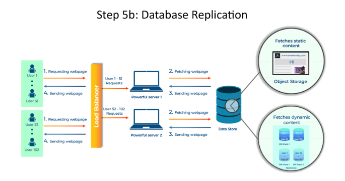

# 📂🔁 **Database Replication** 

---

## **👋 Introduction**

Welcome back, system designers! 🎉 We've learned about database sharding to handle increased load. Now, let's explore another crucial technique for ensuring database reliability and availability: **replication**. 🛠️

---

## **🤔 What is Database Replication?**

Replication involves creating copies of your database shards. These copies, called **replicas**, act as backups, ensuring that if one shard fails, the system can continue operating smoothly. 🔄

---

## **❓ Why Replicate?**

- **🛡️ Fault Tolerance**: If a shard crashes, its replica takes over, preventing data loss and downtime.
- **⚡ Read Performance**: Distribute read operations across multiple replicas to improve performance.
- **🌍 Disaster Recovery**: Replicas in geographically diverse locations protect against regional outages.

 📊

---

## **🚗 Analogy**

Imagine carrying a spare tire in your car. 🚘 It adds weight, but if you get a flat tire, you can quickly swap it out and keep driving. Similarly, replicas ensure your system keeps running smoothly even if one shard fails. 🛠️

---

## **🔄 Types of Replication**

- **👑➡️🤖 Master-Slave Replication**: One master shard handles writes, and changes are replicated to slave shards for read operations.
- **👑⬌👑 Master-Master Replication**: Both shards can handle reads and writes, providing higher availability.

---

## **🌟 Benefits of Database Replication**

- **⏱️ High Availability**: Ensures the system remains operational even with failures.
- **🔒 Data Protection**: Safeguards against data loss due to hardware or software issues.
- **🚀 Improved Performance**: Potentially enhances read performance by distributing load.

---

## **⚠️ Considerations**

- **⚖️ Consistency**: Maintaining data consistency across replicas can be challenging.
- **🧩 Complexity**: Setting up and managing replication adds complexity to the system.
- **💸 Cost**: Storing and maintaining multiple copies of data increases storage costs.

---

### 🔙 [Back](../README.md) ↩️
