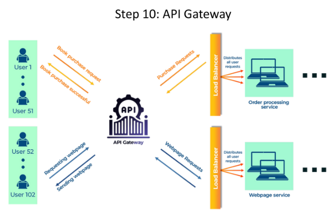

# **🚪 API Gateway**

## **⚠️ The Challenge: Managing Diverse Requests**

🌐 As your system grows, users interact with it in various ways: browsing web pages, placing orders, accessing data through mobile apps, etc. Managing these diverse requests without a central point of control can become chaotic. 🤯

---

## **✅ The Solution: API Gateway**

🛂 An API gateway acts as a single entry point for all incoming requests. It's like a **receptionist** in an office, directing visitors to the appropriate department. 🗂️

---

## **🛠️ How it Works**

1. **📥 Receive Request:** All requests, regardless of type, first arrive at the API gateway.
2. **🛤️ Route Request:** The API gateway analyzes the request and routes it to the appropriate service (e.g., web server, order processing service, user authentication service).
3. **🧩 Aggregate Responses:** If a request requires multiple services, the API gateway combines the responses before sending them back to the user.

---

## **🌟 Benefits of Using an API Gateway**

* **🎯 Centralized Management:** Provides a single point of control for all API requests.
* **🤝 Simplified Client Interactions:** Clients interact with the gateway instead of multiple services.
* **🔒 Security:** Enforces security policies like authentication and authorization.
* **🕵️ Abstraction:** Hides the internal structure of the backend services from clients.
* **⚡ Reduced Latency:** Optimizes requests and responses to improve performance.

---

## **🏢 Analogy**

👩‍💼 Imagine a large company with multiple departments (sales, marketing, customer support). Instead of clients having to contact each department directly, they interact with a **central receptionist** who directs them to the right place. 🗂️

---

## **💡 Use Cases for API Gateways**

* **🧩 Microservices:** Manage requests to multiple microservices.
* **📱 Mobile Applications:** Provide a secure and efficient way for mobile apps to access backend services.
* **🌐 Third-Party APIs:** Control access and usage of external APIs.
* **📶 IoT Devices:** Handle communication between IoT devices and backend systems.

---

### **↩️ [Back](../README.md)**