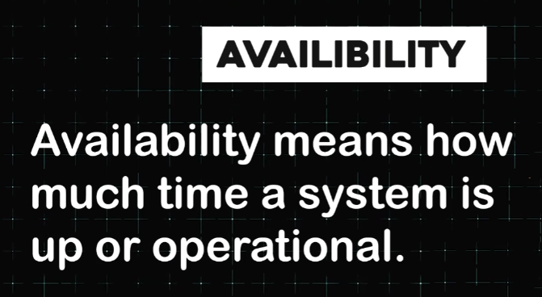

# **Availability: A Critical Design Goal**

## **Introduction**

Availability is another critical goal in system design. It refers to how much time a system is operational and accessible to users. To understand this concept better, let’s explore a few relatable examples.

## **Everyday Examples of Availability**

### **The 24/7 Convenience Store**

Imagine your favorite 24/7 convenience store. It’s always open, day or night, ready to provide what you need whenever you need it. This reliability makes it a go-to option for customers.

### **Online Banking**

Consider online banking. A platform that’s available 24/7 ensures you can access your account and perform transactions at any time of the day. For instance, if you need to transfer money urgently, the system’s availability becomes crucial. You wouldn’t want your bank to be inaccessible at such a critical moment.

## **Measuring Availability: The Concept of "Ninths"**

Availability is often expressed in terms of "ninths."

### **Understanding Ninths**

For example, if a system has 99.999% availability (commonly referred to as "five nines"), it means the system is allowed only five minutes of downtime per year. This translates to 0.001% of the total time being unavailable.

### **The Scale of Reliability**

Having such a high level of availability is impressive. It’s akin to your favorite 24/7 convenience store being closed for just five minutes in an entire year.

---
## **Conclusion**

High availability ensures systems remain reliable and accessible, providing a seamless experience for users. Whether it’s a convenience store or an online banking platform, availability is a cornerstone of user satisfaction and trust.

---

[back](../README.md)