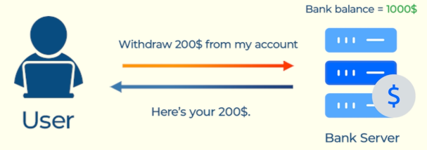
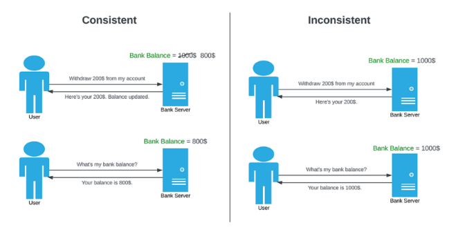

# **Consistency: An Important Design Goal**

## **Introduction**

Consistency is another critical goal in system design. It ensures that everyone sees the same information at the same time. Let’s delve into the concept with a simple analogy and examples.

## **Understanding Consistency Through an Analogy**

Imagine a teacher announcing a test scheduled for tomorrow. If all students are informed at the same time, the information is consistent. However, if only half the students hear the announcement while the other half remain unaware, that’s inconsistency.

## **Types of Consistency**

There are two primary types of consistency:

### **Strong Consistency**

Strong consistency ensures that as soon as information is updated, everyone sees the updated information immediately. The emphasis is on the word “immediately”—there is no delay.

#### **Example of Strong Consistency**

Suppose you have `$1,000` in your bank account. You withdraw `$200`. The bank updates your balance to `$800` immediately. If you or someone else checks your balance, it shows `$800` right away.

### **Eventual Consistency**

Eventual consistency means that the information will become consistent across all systems over time, but not instantly. There might be a short delay before everyone sees the updated information.

#### **Example of Eventual Consistency**

Suppose you have `$1,000` in your bank account. You withdraw `$200`. For a short time, the bank might still display your balance as `$1,000`. Eventually, it updates to reflect $800, ensuring everyone sees the correct amount over time.

---
## **Conclusion**

Understanding the difference between strong and eventual consistency is crucial in designing systems that balance immediacy with scalability and performance. The choice between the two depends on the specific requirements and use cases of the system.

---

### 🔙 [Back](../README.md)
