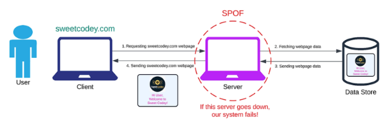
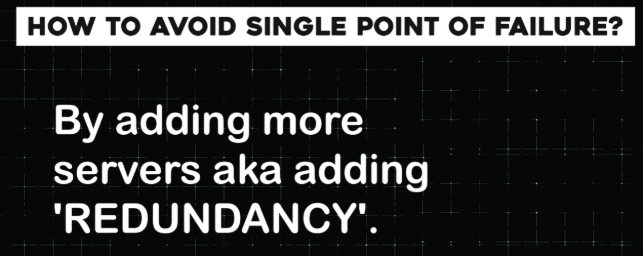
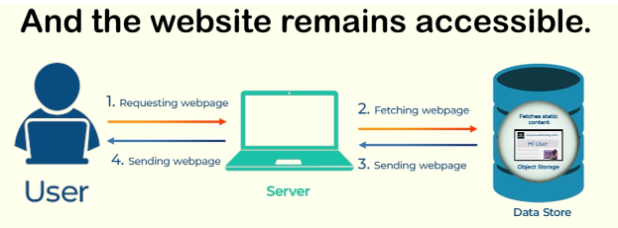

# 🛡️ **Fault Tolerance: Avoiding a Single Point of Failure** 
---

## 🧩 **Understanding Single Point of Failure**

### 🌉 **The Bridge Analogy**

Imagine crossing a bridge supported by a single pillar. If that pillar collapses, the entire bridge falls. This pillar is the **single point of failure** for the bridge. If it fails, the whole structure becomes unusable. 🚧

### 💻 **In System Design**

Similarly, in system design, we strive to avoid any single point of failure that could bring the entire system to a halt. ⚠️

---

## 🌐 **Example: A Website Flow**

Let’s consider a website as an example:

1. A user tries to open the website.
2. The client sends a request for a web page.
3. A server handles the request and fetches the web page from a data store.

Now, what happens if the server goes down? The entire website becomes inaccessible. Here, the server is the **single point of failure**. If it fails, the entire flow stops working. 🛑

---

## 🛠️ **Avoiding Single Point of Failure**

To prevent this, we introduce **redundancy** by adding more servers. This ensures that:

- If one server fails, others can take over. 🔄
- Continuous operation is maintained even during partial failures. 🚀

By doing so, we make the system **fault-tolerant**. 🛡️

---

## 🏗️ **Examples of Fault-Tolerant Systems**

1. **Server Redundancy:** If one server in a data center fails, another server takes over, keeping the website accessible. 🖥️
2. **Data Center Redundancy:** If an entire data center goes down, traffic is rerouted to another data center, ensuring uninterrupted service. 🌍

---

## 🏁 **Conclusion**

Fault-tolerant design ensures that systems remain operational despite failures, enhancing **reliability** and **user experience**. By avoiding single points of failure and introducing redundancy, we create systems that are resilient and dependable. 💪

---

### **🔙 [Back](../README.md)** ↩️
