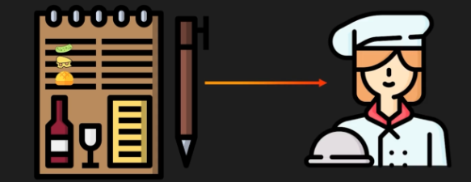

# **GraphQL API: A Restaurant Analogy** 🍔🍴

## **📖 Introduction**

🤔 In this document, we will explore the concept of a GraphQL API using a restaurant analogy. This will help clarify how GraphQL functions and how it differs from traditional REST APIs.

---

## **🧩 GraphQL API: The Customization Analogy**

🖼️ 

🍽️ Imagine you're at a restaurant. Instead of simply choosing from a fixed menu, you decide to customize your meal. Perhaps you want a burger with extra pickles, extra cheese, and a gluten-free bun.

🖼️ 

* 👨‍🍳 The waiter takes note of your custom order and communicates it to the chef.

🖼️ 

* 🍳 The chef prepares the meal exactly as per your request.

🖼️ 

* 🛎️ The waiter then brings the tailored meal to you, exactly how you asked for it.

💡 This is how GraphQL operates in the digital world.

---

## **🔄 Comparing REST and GraphQL**

### **📜 REST API**

🍴 With REST, you typically have a fixed menu of options. If you want something specific, like a burger with extra pickles, extra cheese, and a gluten-free bun, you would need to make separate requests for each item:

1. 📥 One request for the burger.
2. 📥 Another for extra pickles.
3. 📥 Another for extra cheese.
4. 📥 And one more for the gluten-free bun.

🧩 Then, you would need to assemble everything yourself.

---

### **🧩 GraphQL API**

🍔 In contrast, GraphQL allows you to customize your request. You describe your complete custom order in a single query, and the server (like the chef) processes this detailed request and delivers exactly what you need in one go.

* **📤 Client Request:** Just like ordering your customized burger in one request, GraphQL allows you to request multiple pieces of information in one query.
* **📥 Server Response:** The server understands the full context of your request and delivers the exact data you need.

---

## **📝 Example of GraphQL in Action**

🖼️ 

* 💻 The client sends a single query to the server asking for a block of content.
* 📚 This content could include related posts, authors, and their recent comments.

🍴 In this analogy, it’s like asking the waiter to bring your customized burger, along with the pickles, cheese, and gluten-free bun, all in one go.

---

## **🎯 Conclusion**

✨ GraphQL simplifies the process by allowing clients to request exactly what they need in a single query, eliminating the need for multiple requests and responses. It empowers users with flexibility and precision when interacting with APIs, much like customizing a meal in a restaurant.

---

### ↩️ 🔙 [Back](../README.md)