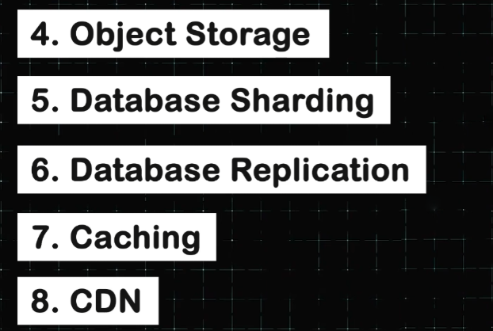

# **📊 Data Management and Storage in System Design** 🖥️

## **🌟 Introduction**

1. **📚 Relational Databases (SQL)**
   * First, we'll look at the relational or the SQL database. 🗃️

2. **📂 Non-Relational Databases (NoSQL)**
   * Then, we'll understand the non-relational or the NoSQL database. 🗄️

3. **🤔 Choosing Between SQL and NoSQL**
   * Then, we'll understand how we can choose between a SQL and a NoSQL database. ⚖️

---

4. **📦 Object Storage**
   * We'll look at object storage. 🗃️

5. **🔪 Database Sharding**
   * Then, we'll understand database sharding. ✂️

6. **🔄 Database Replication**
   * We'll also explore database replication. ♻️

7. **💾 Caching**
   * After that, we'll look at caching. 🚀

8. **🌐 CDNs (Content Delivery Networks)**
   * Eventually, we'll look at CDNs. 📡

---

### 🔙 [Back](../README.md) ↩️