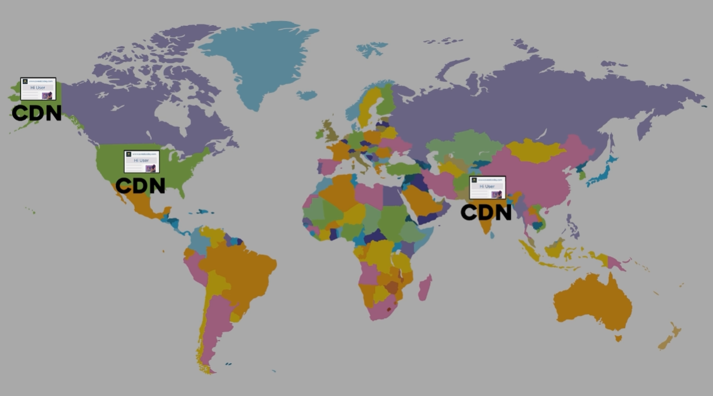

# Boosting Website Speed with CDNs 🌍

## **🧩 What is a CDN?**

📚 Welcome back, amazing design enthusiasts! Today, we’re exploring a game-changing tool that makes websites **blazingly fast**, no matter where your users are in the world.  
🔍 It’s called a **CDN (Content Delivery Network)**, and it’s here to revolutionize how we deliver content online.

---

### 🚀 Why Do We Need CDNs?
⚡ Let’s start with an example. Imagine a website, **SweetQuora.com**, has all its servers located in the US. Now, a user from India tries to access the site.

📦 The website’s assets—like images, videos, and other static content—are bulky. For the user in India, this content has to travel **all the way from the US**, increasing **latency** (the delay before data transfer begins).

🔍 This long journey means the user has to wait longer for the website to load. **Not ideal, right?**

---

### 🎯 How Does a CDN Work?

🔍 A CDN solves this problem by storing **copies of your website’s static content** (content that doesn’t change often, like images, videos, and files) on servers located **around the world**.

#### **Example in Action**

- A user in India accesses **SweetQuora.com**.
- Instead of fetching content from the US, the CDN delivers it from a **nearby server in India**.
- Similarly, a user in the US gets the content from a **CDN server in the US**.

📊 This drastically **reduces the distance** data has to travel, making the website load **much faster**.

---

### 🌍 Benefits of Using a CDN
🛠️ CDNs are a must-have for modern websites. Here’s why:

#### **Speed**
⚡ By serving content from servers closest to the user, CDNs **reduce latency** and make websites load faster.

#### **Global Reach**
🌍 No matter where your users are, a CDN ensures they get a **fast and consistent experience**.

#### **Scalability**
📈 CDNs handle **high traffic** effortlessly, making them perfect for websites with a global audience.

#### **Reduced Server Load**
🖥️ By offloading static content delivery to CDN servers, your origin server can focus on dynamic content, improving overall performance.

---

### 🧩 How Does a CDN Improve User Experience?
🔍 Let’s break it down:

#### **Faster Load Times**
📊 Users don’t like waiting. With a CDN, your website loads **instantly**, keeping users engaged.

#### **Better Performance**
🚀 A fast website improves **user satisfaction** and reduces bounce rates.

#### **Global Accessibility**
🌍 Whether your users are in India, the US, or anywhere else, they get the same **fast and seamless experience**.

---

### 🏁 Summary: Why CDNs Matter!

📊 CDNs are **essential** for modern web design. They:
- **Speed up websites** by reducing latency.
- **Improve global accessibility** by serving content from nearby servers.
- **Enhance scalability** and reduce server load.

---

### 💡 Key Takeaway
🌱 In a world where **speed and accessibility** are critical, CDNs are the secret sauce to delivering a **fast, reliable, and global user experience**.  
🚀 Whether you’re building a small blog or a large-scale e-commerce site, a CDN ensures your website **shines** for users everywhere.

---

### 🎯 Final Thoughts

🔧 CDNs aren’t just a technical tool—they’re a **strategic advantage** for anyone building websites in today’s globalized world.  
🛠️ By leveraging CDNs, you can ensure your website is **fast, scalable, and ready to impress users** no matter where they are.

---

### ↩️ 🔙 [Back](../README.md)