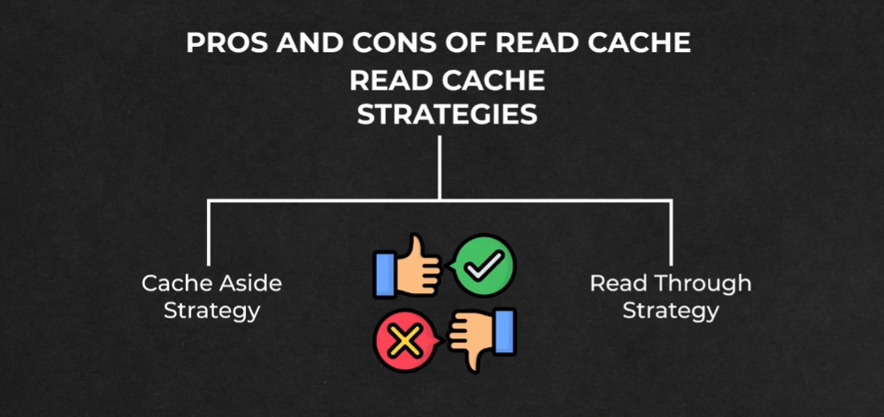
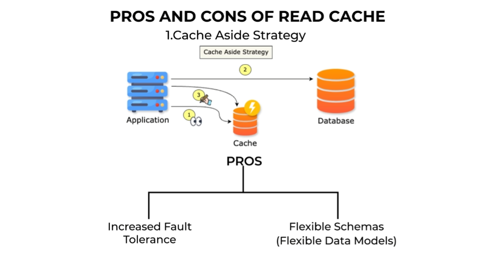
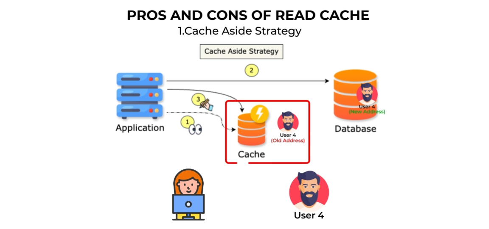

# Pros and Cons of Read Caching Strategies 🗂️

---

### 🌟 **Introduction** 

In this document, we will explore the **pros and cons** of two widely used read caching strategies: **Cache Aside** and **Read Through**. Understanding these strategies helps in making informed decisions about which approach to use based on system requirements and constraints.

---

### 🔄 **1. Cache Aside Strategy** 

#### 🛠️ **How It Works?** 

1. **✅ Step 1: Check the Cache**
   - The application first checks if the requested data is available in the cache.
   - If the data is present (**cache hit**), it is returned directly from the cache.

2. **❌➡️📂 Step 2: Cache Miss and Database Fetch**
   - If the data is **not** in the cache (**cache miss**), the application fetches it from the database.

3. **🔄📥 Step 3: Update the Cache**
   - After retrieving the data, the application updates the cache for future requests.

---

#### 👍 **Pros of Cache Aside Strategy** 

1. **🎯 Increased Fault Tolerance**
   - If the cache fails, the system can still function by fetching data directly from the database.
   - This ensures **no downtime**, even though the response time may be slower.

2. **📊 Flexible Data Models**
   - The application controls the cache, allowing the cache and database to have **different data structures**.
   - Example: The cache may store only frequently accessed fields (e.g., user name and contact details), while the database holds the complete user profile.

---

#### 👎 **Cons of Cache Aside Strategy** 

1. **⚠️ Stale Data Problem**
   - If the database is updated (e.g., a user’s address changes), the cache may still hold the old data.
   - This leads to **inconsistent data** being served to the application.

2. **🛠️ Cache Invalidation Required**
   - To address stale data, the cache must be **invalidated** periodically.
   - During invalidation, old data is removed, forcing a cache miss on the next request.
   - The updated data is then fetched from the database and stored in the cache.

---

### 📖➡️ **2. Read Through Strategy** 

#### **How It Works?** 🛠️
1. **✅ Step 1: Check the Cache**
   - The application requests data from the cache.

2. **❌➡️📂 Step 2: Cache Miss and Cache Fetches Data**
   - If the data is **not** in the cache (**cache miss**), the cache itself fetches the data from the database.

3. **🔄📥 Step 3: Cache Updates Itself**
   - The cache updates itself with the fetched data and serves it to the application.

---

#### 👍 **Pros of Read Through Strategy** 

1. **🎯 No Stale Data Problem**
   - When paired with the **Write Through** strategy, the cache and database are always in sync.
   - Example: If a user’s address is updated, both the cache and database are updated simultaneously, ensuring **fresh data**.

2. **📊 Simplified Application Logic**
   - The application does not need to manage cache updates, as the cache handles this automatically.

---

#### 👎 **Cons of Read Through Strategy** 

1. **⚠️ Cache Failure Can Cause Downtime**
   - If the cache fails, the application cannot read data directly from the database.
   - This is because **all reads go through the cache**, making the system unavailable during cache failures.

2. **📊 Limited Flexibility in Data Modeling**
   - The cache and database must have the **same data structure**.
   - This reduces flexibility in customizing what data is stored in the cache.

---

### ⚖️ **Comparison: Cache Aside vs. Read Through**

| **Aspect**                | **🔄 Cache Aside**                        | **📖➡️ Read Through**                  |
|---------------------------|------------------------------------------|-----------------------------------------|
| **Fault Tolerance**        | High (database acts as fallback)         | Low (cache failure causes downtime)     |
| **Data Consistency**       | Stale data possible (requires invalidation) | Always fresh (when paired with Write Through) |
| **Flexibility in Data Models** | High (cache and database can differ)    | Low (cache and database must match)     |
| **Application Complexity** | Higher (application manages cache)       | Lower (cache manages itself)            |

---

### 🎯 **Conclusion**
Both **Cache Aside** and **Read Through** strategies have their own strengths and weaknesses:

- **🔄 Cache Aside:**
   - Best for systems requiring **high fault tolerance** and **flexible data models**.
   - Requires careful handling of **stale data** through cache invalidation.

- **📖➡️ Read Through:**
   - Ideal for systems prioritizing **data consistency** and **simplified application logic**.
   - Vulnerable to **downtime** during cache failures and offers **less flexibility** in data modeling.

---

### 📝 **Additional Notes** 
- **🎯 Cache Hit:** Data is found in the cache.
- **❌ Cache Miss:** Data is not found in the cache, requiring a database fetch.
- **🔄 Cache Invalidation:** Process of removing stale data from the cache.
- **📂 Write Through Strategy:** Ensures cache and database are updated simultaneously during writes.

--- 

### ↩️ 🔙 [Back](../README.md)

