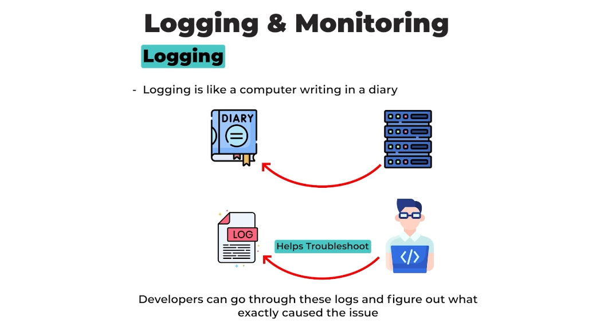
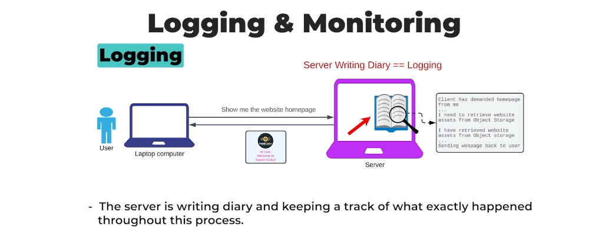
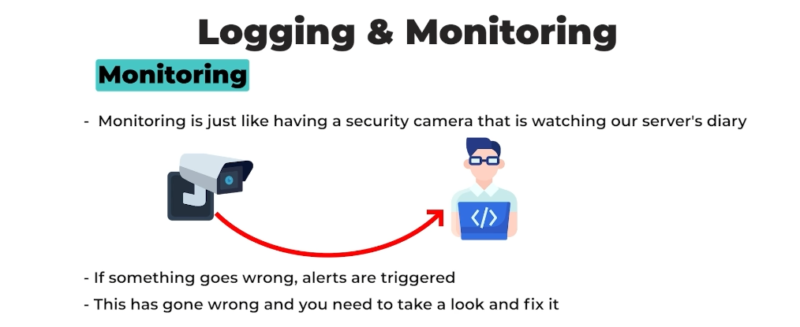
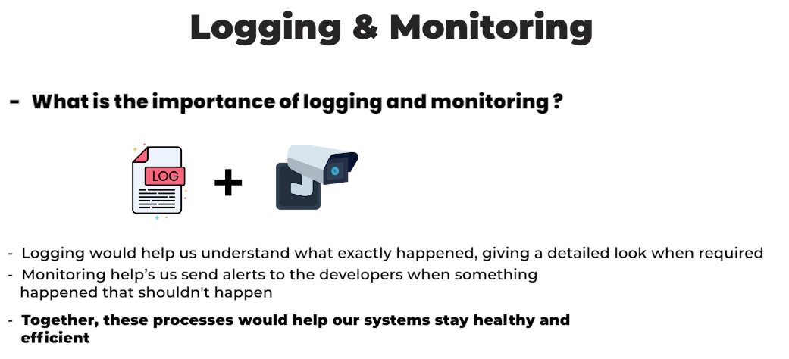

# **🌐 Understanding Logging & Monitoring**

## **📔 What is Logging?**

🖥️ Logging is like a computer writing its diary.

📝 Just as you jot down important events, thoughts, or issues in a diary, a server logs all its key activities. For example:

- What requests it is executing.
- How it is processing those requests.
- What responses it is sending back to the client.
- Any errors it encounters.
- Other notable system events.

🐾 Think of logs as **footprints left behind**. If something goes wrong, developers can review these logs to pinpoint the exact cause of the issue. This makes troubleshooting much easier!

---

## **📊 Practical Example**

🏠 In the diagram below, you can see the server logging the time whenever it receives a request. It notes down each step to maintain a clear record of what happened.

#### **Example in Action**

1. The client requests the website’s homepage.
2. The server logs:
   - *"The client requested the homepage from me."*
   - *"I need to retrieve the website assets from object storage."*
3. After retrieving the assets, it logs:
   - *"I have successfully retrieved the website assets from object storage."*

---

## **🔍 Why is this important?**

🚨 Logging is essential for maintaining transparency and traceability in a system. With logging, you can:

- Quickly identify errors.
- Improve system efficiency.
- Ensure everything works as expected.

---

## **🛠️ What about Monitoring?**

👀 While logging is like writing a diary, monitoring is like **observing in real-time** what’s happening in the system. It helps ensure everything runs smoothly and alerts you to potential issues before they become critical.

---

## **🎯 Conclusion**

👁️ Logging and monitoring are powerful tools for keeping systems healthy and efficient. They act as the **eyes and memory** of your server!

---

### ↩️ 🔙 [Back](../README.md)

