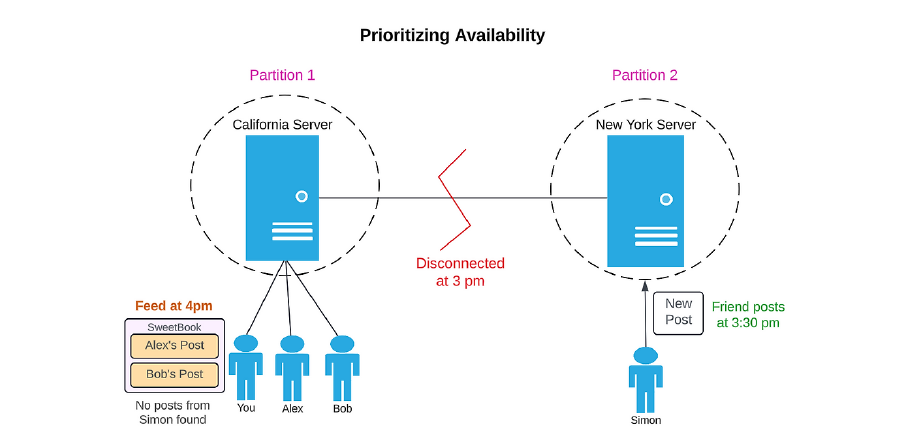

# **⚖️ Understanding the CAP Theorem**

## **🌍 What is the CAP Theorem?**

🔹 Ideally, we want our systems to be both **consistent** and **available** at all times.

🚨 But what happens if a network failure creates a **partition** in our system?

📌 The **CAP Theorem** states that during a partition, a system can either prioritize **availability** or **consistency**—but not both at the same time.

---

## **🛠️ Example in Action**

Imagine a social media company called **SweetBook** that has servers worldwide.

#### **Scenario: A Network Partition Occurs**

📅 At **3:00 PM**, an accident disrupts the connection between **New York** and **San Francisco** servers. A partition has now formed.

📌 At **3:30 PM**, your friend in **New York** posts a new status update.

Now, two things can happen:

🔹 If **SweetBook prioritizes availability**, the site remains accessible, but users in **San Francisco won’t see the new post** until the partition is resolved.

🔹 If **SweetBook prioritizes consistency**, users in **San Francisco** might see a message like **"Website not available"**, ensuring they only receive accurate data.

🚨 **You cannot have both consistency and availability at the same time when a partition exists.**

---

## **🎯 Final Thoughts**

🔑 The **CAP Theorem** helps us understand trade-offs in distributed systems:
- **Consistency** ensures users always see the latest updates.
- **Availability** ensures the system is always accessible.
- **Partition Tolerance** means the system can handle network failures.

🌟 Modern systems often balance these trade-offs depending on their needs, choosing strategies like **eventual consistency** to mitigate disruptions.

---

### ↩️ 🔙 [Back](../README.md)

