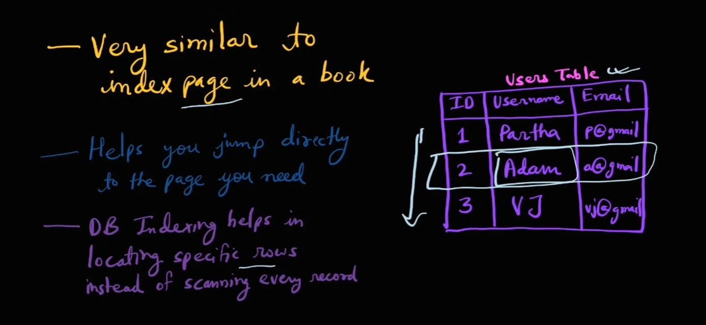
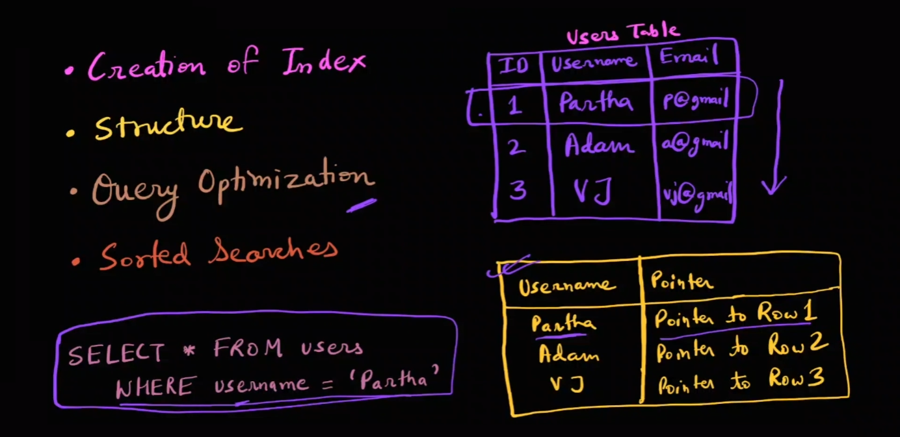
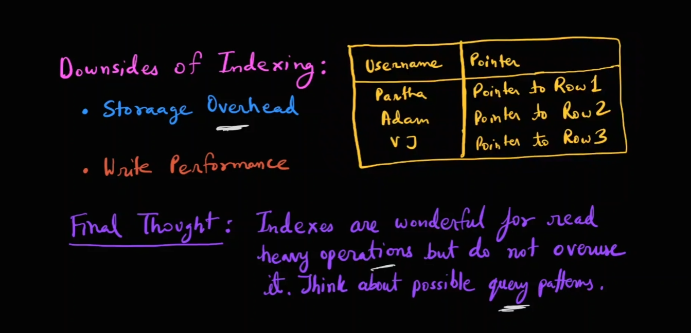

# 📚 Database Indexing 🗂️


## 🎬 Introduction

1. **❓ What exactly is database indexing?**
2. **🛠️ How do we create indexes?**
3. **🤖 Does the database automatically add indexes?**
4. **🚫 Should we use indexing everywhere?**

---

## 🧐 What is Database Indexing? 📖


Database indexing is akin to the **index page in a book**. Imagine searching for a recipe in a cookbook. Instead of flipping through every page, you use the index to find the exact page number instantly. Similarly, database indexing helps locate specific rows without scanning every record.

#### For example:  


- Consider a `users` table with columns for **ID**, **username**, and **email**. If you want to find a user named "Adam," indexing allows you to access the relevant row almost instantly, much like using a book's index to find a recipe.

---

## 🛠️ Creating Indexes 🔧

### 🏗️ How Indexes are Created


Indexes are created on **specific columns** of a table. For instance, if we create an index on the `username` column, it creates a **shortcut** based on usernames. This shortcut maps each username to a **pointer** that directs to the corresponding row in the table.

### 🗄️ Storage of Indexes


Indexes are typically stored using data structures like **B-trees** 🌳 or **hash tables** 🗃️. B-trees store data in a **hierarchical, sorted structure**, allowing efficient searching, insertion, and deletion. Hash tables, on the other hand, are useful for **exact match queries**.

### ⚡ Query Optimization



Indexes significantly optimize queries. For example, a query like `SELECT * FROM users WHERE username = 'Partha'` can be executed swiftly if an index exists on the `username` column. The database uses the index to directly locate the row without scanning the entire table.

### 🔍 Sorted Searches


Indexes also aid in **sorted searches**. For instance, if you have an index on the `age` column organized in a B-tree, you can efficiently perform **range queries**, such as finding all users aged between 30 and 40.

---

## 🤖 Automatic Indexing 🤔


Most databases **automatically create indexes** on primary key columns, known as **primary key indexes**. However, **manual indexing** is also possible based on query patterns. For example, if you frequently query the `email` column, you might manually create an index on it using a command like:

```sql
CREATE INDEX idx_name ON users (username);
```

This command creates an index named `idx_name` on the `username` column of the `users` table.

---

## 🚫 The Downsides of Indexing ⚠️

While indexing is powerful, it's not without drawbacks:



1. **💾 Storage Overhead**: Each index consumes additional disk space.
2. **✍️ Write Performance**: Insert, update, and delete operations require updating indexes, which can slow down **write-heavy applications**.

Therefore, it's crucial to create indexes **judiciously**, focusing on common query patterns to balance read efficiency and write performance.

---

## 🎯 Conclusion 🏁

Indexes are **invaluable** for **read-heavy operations**, enhancing query performance significantly. However, they should be used **thoughtfully** to avoid unnecessary storage and performance overheads. By understanding and applying these concepts, you can optimize your database interactions effectively.

---

### ↩️ 🔙 [Back](../README.md)