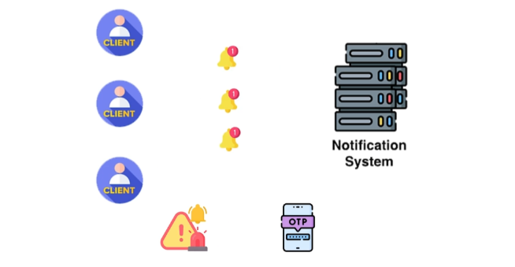
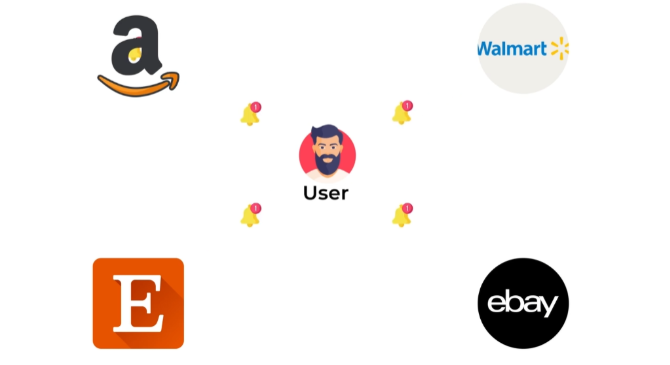
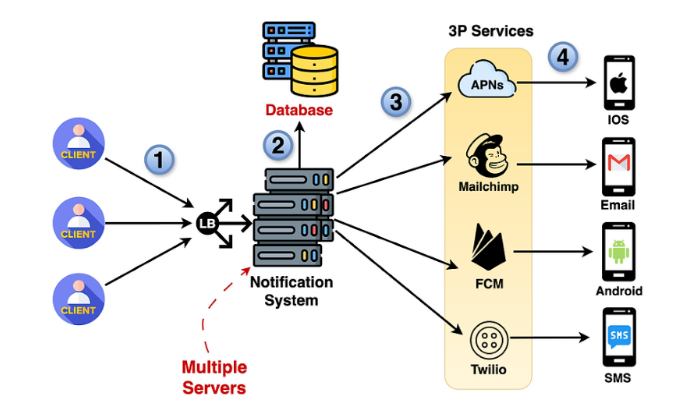

# **📡 High-Level Design: Refining the Notification System**

This document delves deeper into the high-level design of the notification system, analyzing its core responsibilities and refining the architecture to address potential bottlenecks and improve performance.

---

## **🔑 Core Responsibilities of the Notification System**

The notification system handles a variety of tasks to ensure efficient and user-centric notification delivery:

---

### **1. 🚨 Prioritization and Validation**

* Not all notifications are created equal. The system needs to prioritize critical alerts (e.g., security breaches, transaction alerts) over less urgent ones (e.g., marketing promotions).
* Validation ensures that notifications are legitimate and come from authorized sources.

---

### **2. ⏳ Rate Limiting**
* Prevents spamming and overload by limiting the number of notifications a user receives within a specific timeframe.
* Protects users from notification fatigue and potential churn.

* **📊 Example:**  
  
    * A user subscribed to multiple e-commerce sites shouldn't receive hundreds of notifications per hour.

---

### **3. 🛠️ Filtering**

* Manages the relevance of notifications by filtering them based on user preferences.
* Users can customize their notification settings to receive only the types of notifications they want via their preferred channels (e.g., push notifications for urgent updates, emails for newsletters).

---

### **4. 📤 Delivery**

* Ensures notifications are delivered to the correct users on their preferred devices and through the appropriate channels (in-app, SMS, email).

---

## **📝 Deriving Responsibilities from Functional Requirements**

These core responsibilities are derived from the functional requirements established in the initial design phase. Understanding and analyzing functional requirements is crucial for identifying the key tasks and features the system needs to support.

---

## **⚠️ Addressing Limitations of a Single-Server Design**

A single-server architecture for the notification system presents several limitations:

* **❌ Single Point of Failure:** If the server fails, the entire system goes down, impacting availability and reliability.
* **💾 Data Loss Risk:** Storing data solely on the server risks data loss in case of server failure.
* **🐢 Performance Bottleneck:** A single server handling all tasks can become a bottleneck as the system scales and the volume of notifications increases.

---

## **🚀 Introducing Multiple Servers and Databases**

To address these limitations, the design is enhanced with:

* **🖥️ Multiple Servers:** Introducing multiple instances of the notification system with load balancing improves availability, redundancy, and scalability.
* **🗄️ Database:** Storing data in a database ensures persistence and prevents data loss in case of server failures.

---

## **🔧 Further Refinement with Microservices**

To further optimize performance and scalability, the system can be decomposed into specialized microservices:

* **🧩 Microservices for Specific Tasks:** Each microservice focuses on a specific responsibility, such as validation, prioritization, filtering, and user preference management. This separation of concerns improves efficiency and allows for independent scaling of individual components.
    * **🔍 Validation Service**
    * **🚦 Prioritization Service**
    * **🛠️ Filtering Service**
    * **⚙️ User Preferences Service**

---

## **🎯 Conclusion**

By refining the high-level design with multiple servers, a database, and microservices, the notification system can achieve higher availability, scalability, and performance. This ensures efficient and reliable notification delivery while accommodating future growth and evolving user needs.

---

### 🔙 [Back](../README.md)