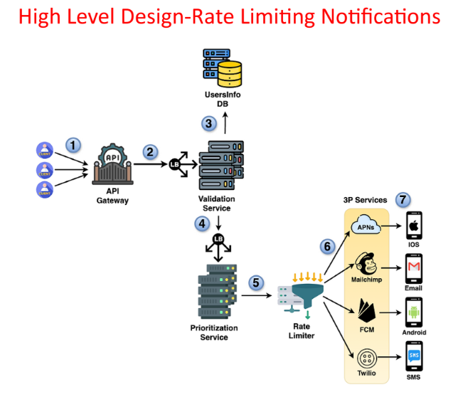
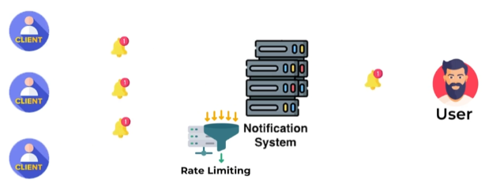

# **📡 High-Level Design: Incorporating Rate Limiting**

This document explains how to integrate rate limiting into the notification system's high-level design to prevent spamming and protect users from notification overload.

---

## **⚠️ Why Rate Limiting is Essential**

Rate limiting is a crucial mechanism for controlling the flow of notifications to users. It prevents users from being bombarded with too many notifications within a short period, which can lead to frustration and a negative user experience.

**📊 Example:**

* If a user has already received several promotional notifications within an hour, the rate limiter can delay or discard further promotional messages to avoid overwhelming the user.

---

## **🛠️ Updated Design with Rate Limiter**

The following diagram illustrates the updated design with the rate limiter incorporated:

The key change in this design is the addition of the rate limiter as a step in the notification flow.

---

## **📨 Notification Flow with Rate Limiting**

The optimized flow is as follows:

1. **📨 Client Request:** The client sends a notification request to the API gateway.
2. **🛣️ API Gateway Routing:** The API gateway routes the request to the Validation Service.
3. **🔍 Validation:** The Validation Service validates the request.
4. **🚦 Prioritization:** The Prioritization Service assigns a priority level to the notification.
5. **⏳ Rate Limiting:** The Rate Limiter checks the frequency of notifications for the target user. If the user has already received a certain number of notifications within a defined time window, further notifications are delayed or discarded.
6. **📤 Delivery Service Routing:** Notifications that pass the rate limiter are forwarded to the appropriate delivery service (APNs, FCM, Twilio, or Mailchimp).
7. **📤 Delivery:** The delivery service sends the notification to the user's device.

---

## **✅ Benefits of Rate Limiting**

* **🚫 Prevents Spamming:** Protects users from being overwhelmed by excessive notifications, especially marketing or less critical messages.
* **😊 Improves User Experience:** Reduces notification fatigue and ensures users receive notifications at a manageable pace.
* **🛡️ Protects System Resources:** Prevents abuse and overload of the notification system, ensuring it can handle legitimate traffic efficiently.

---

## **🎯 Conclusion**

Incorporating rate limiting into the high-level design is crucial for building a responsible and user-friendly notification system. This mechanism helps maintain a positive user experience, prevents abuse, and ensures the system's stability and performance.

---

### 🔙 [Back](../README.md)