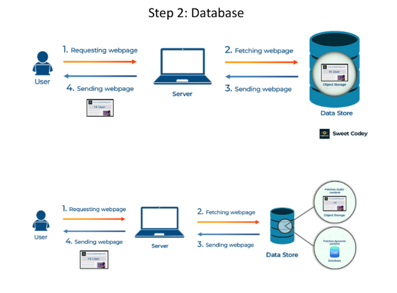
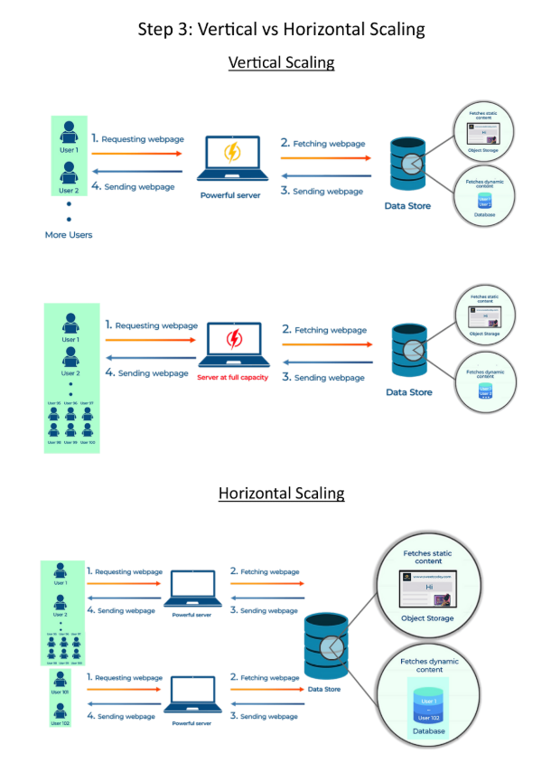

# **🗃️ Database: The Heart of Data Management**

Welcome back, system designers! 🚀 In the previous section, we explored clients and servers. Now, let’s dive into another critical component of system design: the **database**. This document will help you understand what databases are, their types, and why they are essential for building robust systems.

---

## **⚠️ The Problem: Where Does Your Data Live?**

Imagine a vast, organized library where all your website’s data resides. This library is your **database**. It stores everything from user information and product details to blog posts and comments. But how do you choose the right database for your system? And why is it so important?

---

## **🛠️ The Solution: Understanding Databases**

A database is a structured system for storing, managing, and retrieving data. It acts as the backbone of any application, ensuring data is organized, secure, and accessible.

---

### **📚 Types of Databases**

There are various types of databases, each with its strengths and weaknesses. Some popular ones include:

* **📊 Relational Databases (SQL):**  
  These databases organize data into tables with rows and columns, much like a spreadsheet. They are ideal for structured data and complex queries.  
  Examples: MySQL, PostgreSQL, Oracle.

* **📂 NoSQL Databases:**  
  These databases offer more flexibility and scalability, often used for large datasets and cloud-based applications. They are great for unstructured or semi-structured data.  
  Examples: MongoDB, Cassandra, Redis.

---

## **✅ Why Are Databases Important?**

Databases play a crucial role in system design for several reasons:

* **🔒 Data Persistence:** Databases store data securely and reliably, ensuring it’s not lost even if the system crashes.
* **⚡ Efficient Retrieval:** They allow quick access and retrieval of specific information, improving application performance.
* **🗂️ Data Organization:** Databases structure data for easy management, analysis, and scalability.

---

## **🔍 Choosing the Right Database**

Selecting the right database depends on several factors:

* **📐 Data Structure:**
    - Use **SQL databases** for structured data with clear relationships (e.g., user accounts, transactions).
    - Use **NoSQL databases** for unstructured or semi-structured data (e.g., social media posts, sensor data).

* **📈 Scalability Needs:**
    - SQL databases are great for vertical scaling (adding more power to a single server).
    - NoSQL databases excel at horizontal scaling (adding more servers to handle growth).

* **🚀 Performance Requirements:**
    - SQL databases are ideal for complex queries and transactions.
    - NoSQL databases are better for high-speed read/write operations and large-scale data storage.

---

## **📊 Database Workflow in a System**

1. **📨 Client Request:** A user interacts with the application, triggering a data request.
2. **🖥️ Server Processing:** The server receives the request and queries the database.
3. **🗃️ Database Query:** The database retrieves the requested data and sends it back to the server.
4. **📤 Server Response:** The server processes the data and sends it to the client.
5. **📱 Client Rendering:** The client (e.g., browser or app) displays the data to the user.

---

By understanding databases and their role in system design, you can make informed decisions about data storage, retrieval, and management. This knowledge is essential for building scalable, efficient, and reliable systems.

---

### 🔙 [Back](../README.md) ↩️