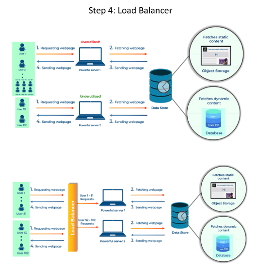

# **⚖️ Load Balancer: Distributing Traffic for Optimal Performance**

Welcome back, system design enthusiasts! 🚀 In our last session, we explored how horizontal scaling (adding more servers) helps handle increased user traffic. However, simply adding servers isn’t enough. We need a way to ensure the workload is distributed effectively across all servers. Enter the **load balancer**—a critical component for optimizing performance and reliability in distributed systems.

---

## **⚠️ The Problem: Uneven Load Distribution**

Imagine adding a second server to handle extra users. If all the existing users remain on the first server, it remains overloaded while the second server sits idle. 🛑 This uneven distribution leads to inefficient resource utilization and can cause performance bottlenecks.

---

## **🛠️ The Solution: Introducing the Load Balancer**

A load balancer acts like a traffic manager, directing incoming user requests to different servers. It ensures no single server is overwhelmed, keeping your system running smoothly. 🚦

---

## **🔧 How It Works**

1. **📨 Incoming Request:** A user request arrives at the load balancer.
2. **🔄 Distribution:** The load balancer distributes the request to one of the available servers using algorithms like Round Robin, Least Connections, or Weighted Distribution.
3. **⚙️ Processing:** The chosen server processes the request and sends the response back to the load balancer.
4. **📤 Response:** The load balancer forwards the response to the user.

---

## **🍽️ Analogy: The Smart Restaurant Manager**

Think of a busy restaurant with two chefs. If all orders go to one chef, they’ll be overworked while the other is idle. A load balancer is like a smart manager who ensures both chefs receive an equal number of orders, ensuring the kitchen runs efficiently. 🧑‍🍳👨‍🍳

---

## **✅ Benefits of a Load Balancer**

* **⚡ Efficiency:** Distributes traffic evenly across servers, maximizing resource utilization and preventing bottlenecks.
* **📈 Scalability:** Easily add or remove servers without disrupting service, making it ideal for growing systems.
* **🛡️ Redundancy:** If one server fails, the load balancer redirects traffic to other servers, ensuring high availability and fault tolerance.
* **🌐 Improved Performance:** Reduces response times by ensuring no single server is overloaded.

---

## **🔍 Load Balancer in Action**

### **1. Health Checks:**
The load balancer continuously monitors server health. If a server goes down, it stops sending traffic to that server until it recovers. 🩺

### **2. Session Persistence:**
For applications requiring user sessions (e.g., shopping carts), the load balancer ensures requests from the same user are directed to the same server. 🛒

### **3. SSL Termination:**
The load balancer can handle SSL/TLS encryption, offloading this resource-intensive task from the servers. 🔒

---

By incorporating a load balancer into your system design, you can ensure efficient resource utilization, seamless scalability, and high availability—key ingredients for building robust and reliable systems.

---

### 🔙 [Back](../README.md) ↩️