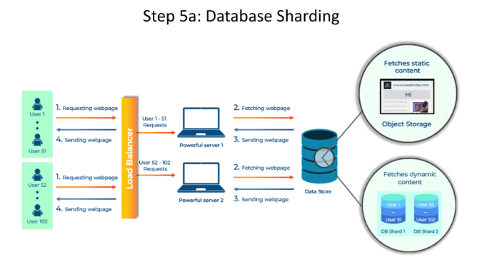

# **🔗 Database Sharding: Scaling Data for High Performance**

---

## **⚠️ The Problem: Database Overload**

A single database handling all user operations can struggle under heavy load. Imagine a small pantry in a busy restaurant trying to store all the ingredients—it’s simply not enough. 🍽️📦 As your user base grows, your database can become a bottleneck, leading to slow queries, timeouts, and even system failures.

---

## **🛠️ The Solution: Database Sharding**

Database sharding is like splitting that pantry into multiple smaller ones. Instead of one overburdened database, we divide it into several smaller databases, each holding a portion of the data. This approach allows you to scale horizontally and handle massive datasets efficiently.

---

## **🔧 How It Works**

1. **📂 Data Partitioning:**  
   Divide the data into distinct "shards" based on specific criteria, such as:
    - **🆔 User ID:** Assign users to shards based on their unique IDs.
    - **🌍 Geographic Location:** Store data for users in different regions on separate shards.
    - **⏰ Time-Based:** Split data by time periods (e.g., monthly or yearly).

2. **🌐 Shard Distribution:**  
   Store each shard on a separate database server. Each shard operates independently, handling its portion of the data.

3. **🔄 Request Routing:**  
   When a request arrives, the system determines the relevant shard and directs the request to the appropriate server. This ensures efficient data retrieval and processing.

---

## **✅ Benefits of Database Sharding**

* **📈 Scalability:** Handle massive datasets and user traffic by distributing the load across multiple shards.
* **⚡ Performance:** Improve query performance by accessing smaller, focused datasets instead of querying a single large database.
* **🛡️ Availability:** Increase fault tolerance—if one shard fails, the others remain operational, ensuring system reliability.
* **🔧 Flexibility:** Choose sharding strategies (e.g., horizontal or vertical) based on your application’s specific needs.

---

## **📚 Analogy: The Library of Data**

Think of a library with millions of books. Instead of one giant, overwhelming section, the library divides the books into categories (fiction, non-fiction, etc.) and places them in separate areas. This makes it easier to find specific books and manage the collection. 📖📚

---

## **🔍 Types of Sharding**

### **1. Horizontal Sharding**
Divide data across multiple servers based on **rows**. For example:
- Users with IDs 1-1000 on **Server 1**.
- Users with IDs 1001-2000 on **Server 2**.

This is the most common sharding strategy and works well for large datasets.

### **2. Vertical Sharding**
Divide data based on **columns**. For example:
- Store **user profile information** on one server.
- Store **user posts or activity logs** on another server.

This approach is useful when different types of data have different access patterns or storage requirements.

---

## **🚀 Sharding in Action**

### **1. 🔄 Consistent Hashing:**
A technique used to distribute data evenly across shards, ensuring minimal data movement when shards are added or removed.

### **2. 🔑 Shard Key Selection:**
Choosing the right shard key (e.g., user ID, location) is critical for even data distribution and efficient query routing.

### **3. 📊 Monitoring and Rebalancing:**
Regularly monitor shard performance and rebalance data as needed to maintain optimal performance.

---

By implementing database sharding, you can ensure your system scales seamlessly with growing data and user traffic, delivering high performance and reliability.

---

### 🔙 [Back](../README.md) ↩️