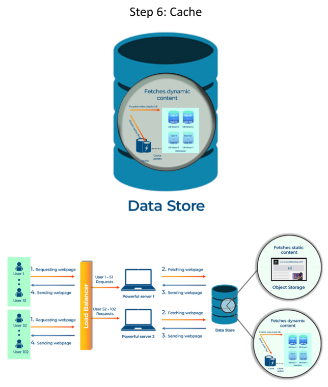

# **Cache** 🗃️⚡

---

## **❗ The Problem: Repetitive Database Queries**

Imagine a user frequently visiting your website. Each visit requires fetching their data from the database, leading to repetitive queries and unnecessary load on the database. 🐌

---

## **💡 The Solution: Caching**

A cache is like a high-speed access point that stores frequently accessed data. Retrieving data from the cache is much faster than fetching it from the database. ⚡

---

## **🛠️ How it Works**

1. **🔍 Check Cache:** When a user requests data, the system first checks the cache.
2. **🎯 Cache Hit:** If the data is found in the cache (cache hit), it's returned quickly.
3. **❌ Cache Miss:** If the data is not found (cache miss), it's retrieved from the database.
4. **📥 Store in Cache:** After retrieving from the database, the data is stored in the cache for future requests.

---

## **📚 Analogy**

Think of your bedside table versus going to the library. If you need a book, you first check your bedside table. If it's not there, you go to the library, borrow it, and then keep it on your bedside table for easy access next time. 🛏️📖

 📊

---

## **🌟 Benefits of Caching**

- **⚡ Improved Performance:** Significantly reduces data access time.
- **📉 Reduced Database Load:** Minimizes strain on the database, improving overall system efficiency.
- **⏱️ Lower Latency:** Faster response times lead to a better user experience.

---

## **🔧 Types of Caching**

- **🌐 Browser Caching:** Stores website assets (images, scripts) in the user's browser.
- **🖥️ Server-Side Caching:** Stores frequently accessed data on the server.
- **🌍 Content Delivery Network (CDN) Caching:** Stores content on servers geographically closer to users.

---

### **↩️ [Back](../README.md)**