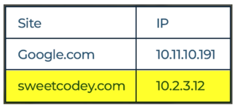

# **🌐 DNS: How Your Browser Finds the Right Server** 🖥️

---

## **🔍 What Happens When You Enter a Website Name?** 🎯

---

### **1️⃣ Step 1: The Browser’s Query** 🔎

When you type **sweetcody.com** in your browser, the browser needs to connect to Sweet Cody’s servers to load the homepage. But first, it must determine where the server is located. 🎯

---

### **2️⃣ Step 2: The Role of DNS** 📚

Here’s how DNS works:

1. Your browser asks, “Where is sweetcody.com?” ❓
2. This query is sent to a DNS server. 📡
3. The DNS server checks its records and responds, “It’s at 10.2.3.12.” 📄
4. Armed with this information, your browser connects directly to Sweet Cody’s servers using the provided IP address. 🔗

Finally, the homepage of **sweetcody.com** loads on your screen. 🖼️

---

## **📖 DNS: The Internet’s Phone Book** 📞

The DNS functions like a phone book. When you enter a website name such as **sweetcody.com**, the DNS translates that name into the corresponding IP address of the server. Without DNS, you would need to memorize the IP addresses of every website you want to visit—a daunting task\! 😱

---

### **✨ Why DNS Makes Life Easier** 😌

Instead of remembering an address like **10.2.3.12**, you simply type **sweetcody.com** into your browser. DNS ensures this translation happens seamlessly, so you can browse the internet effortlessly. 🌍

---

## **🎉 Conclusion** 🚀

The Domain Name System is an essential part of how the internet operates, simplifying the way we access websites by linking human-readable names to machine-readable IP addresses. Thanks to DNS, navigating the web is a user-friendly experience\! 🌐

---

### **🔙 [Back](../README.md)** ↩️