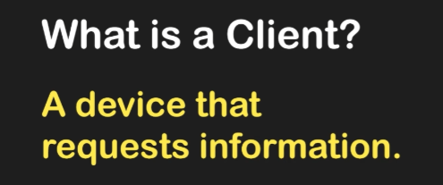
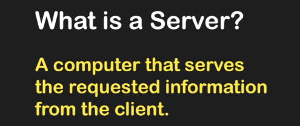
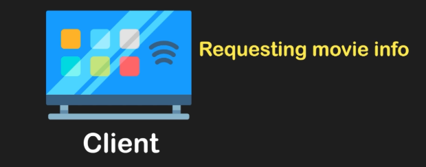
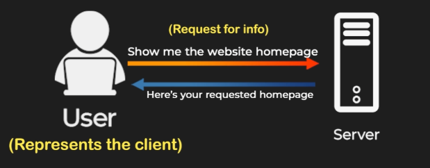

# **The Client-Server Relationship: How the Internet Works** 🌐

## 🧩 **Breaking It Down: Client and Server**

---
### 💻 **What is a Client?**

A client is a computer or device that **requests information**. Examples include:

* 💻 Laptops
* 📱 Smartphones
* 📺 Smart TVs

### 🖥️ **What is a Server?**

---

A server is a computer that **provides or "serves"** the requested information to the client. Servers store the data and resources that clients request. 🗄️

---

## 🌟 **Everyday Examples**

### 🎬 **Example 1: Streaming Movies**

Imagine you’re sitting on your couch, streaming movies on Netflix. Here:

* 📺 **Client**: Your smart TV is requesting the movie data.
* 🎬 **Server**: Netflix’s servers deliver the movie data back to your TV.

### 🗺️ **Example 2: Using Google Maps**

When you use your phone to get directions, the setup is:

* 📱 **Client**: Your phone is requesting location data.
* 🗺️ **Server**: Google Maps’ servers provide the necessary location information.

---

## 🛠️ **How It Works: An Example Interaction**

### 🔄 **Step-by-Step Process**

1. 💻 **Client Request**: A user on their laptop (the client) sends a request: “Show me the website homepage.”
2. 🖥️ **Server Response**: The server hosting the website processes the request and responds with: “Here is your requested homepage.”
3. 🖼️ **Display**: The client receives the data and displays the homepage on the user’s screen.

---

## 🏁 **Conclusion**

Without servers, clients would have no source to fetch the information they need. Similarly, without clients, servers would have no requests to fulfill. Together, they form the **backbone of how the internet operates**, enabling seamless communication and data exchange. 🌐✨

---

### **🔙 [Back](../README.md)** ↩️

