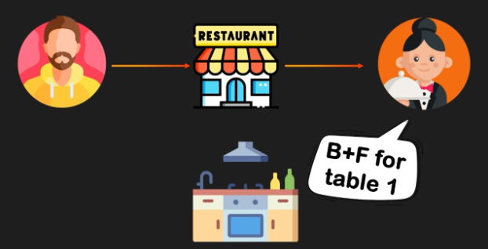

# **gRPC: A Restaurant Analogy** 🍔🍟

## **📖 Introduction**

🤔 In this document, we will explore the concept of gRPC using a restaurant analogy. This analogy will help you understand how gRPC works and how it improves communication between different parts of a system.

---

## **⚡ gRPC: The Quick Communication Analogy**

🍽️ Imagine you are at a restaurant and order a burger and fries. You tell the waiter about your order, and the waiter communicates it to the kitchen staff. However, the waiter doesn’t say the full order out loud. Instead, they use shorthand communication: "D \+ F for table one."

🖼️ 

* 🛎️ The waiter doesn’t specify “one burger and one fries for table one.” Instead, the shorthand "D \+ F" (burger and fries) helps the workers work more efficiently and quickly.

💡 This is very similar to how gRPC works in the digital world.

---

## **🔄 Comparing gRPC and Traditional Communication**

### **📜 Traditional Communication**

📨 In traditional systems, different components may communicate with each other in a verbose manner, requiring full explanations and details for every transaction or action.

---

### **⚡ gRPC and Efficient Communication**

🖼️ 

📦 With gRPC, just like the waiter using shorthand to save time, systems use a method called **Protocol Buffers** (or **protobufs**) to communicate more efficiently. Instead of sending full data, protobufs pack information into smaller, more efficient formats, ensuring faster communication and reduced data transfer.

🖼️ 

---

## **📝 Example of gRPC in Action**

Let’s take a look at an example of how gRPC improves communication between microservices:

🖼️ 

1. **📤 User Request:** A user wants to purchase a course on system design.

   * 💻 The user’s device sends a request to the server to initiate the purchase.
2. **🤝 Microservices Communication:** On the server side, microservices work together to complete the purchase:

   🖼️ 

   * 💳 The **Payment Processing Service** handles the payment.
   * 📚 The **Course Enrollment Service** enrolls the user in the course.
   * 📨 The **User Notification Service** sends a confirmation of the successful purchase.
3. **⚡ gRPC Communication:** All of these microservices communicate with each other using gRPC. This allows them to process the transaction quickly and efficiently, just like the shorthand communication between the waiter and kitchen staff.

---

## **🎯 Conclusion**

✨ gRPC streamlines communication within systems, making it faster and more efficient. By using protobufs, gRPC minimizes the amount of data sent between services, ensuring quicker transactions and better overall system performance, much like the waiter using shorthand to make the restaurant's operations faster.

---

### ↩️ 🔙 [Back](../README.md)