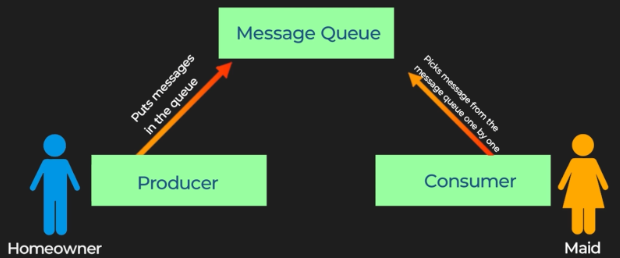

# **Message Queues: A Checklist Analogy** 📋

## **🌟 Introduction**

In this document, we will explore the concept of message queues using a relatable analogy. This will help explain how message queues work and why they are essential for efficient task handling in systems. 🚀

---

## **🏠 Message Queues: The Task Checklist Analogy**

Imagine a homeowner with a long list of tasks to complete:

1. 🍳 Prepare food.
2. 🗑️ Take out the trash.
3. 🧹 Clean the house.
4. 🍽️ Wash the dishes.

These tasks need to be finished before the homeowner leaves for work. The homeowner also has a helper or maid to assist with these chores. 👩‍🍳

---

### **⏳ Scenario 1: One Task at a Time**

In this scenario:

* ➡️ The homeowner assigns tasks to the maid one by one.
* ⏸️ The homeowner waits for each task to be completed before assigning the next one.

* This method is inefficient because:
  * ⏳ Time is wasted waiting for each task to finish.
  * 🏃‍♂️ The homeowner is delayed in leaving for work.

---

### **✅ Scenario 2: Using a Checklist**

In this scenario:

* 📝➡️🏃‍♂️ The homeowner writes down all the tasks on a checklist and then leaves for work.
* 👩‍🍳✅ The maid picks tasks from the checklist and completes them independently.
* This method is much more efficient because:
  * ⏰ The homeowner can leave for work on time.
  * 🐢 The maid works through the tasks at her own pace.

---

## **🔄 How This Relates to Message Queues**

A message queue functions just like the checklist in the second scenario:

* 🏠➡️📥 The homeowner represents the **producer**, who adds tasks (messages) to the queue.
* 📋 The checklist represents the **message queue**, a holding area for tasks.
* 👩‍🍳➡️✅ The maid represents the **consumer**, who processes tasks from the queue.

---

### **🔑 Key Features of Message Queues**

1. **⏩ Asynchronous Processing**: Producers can add messages to the queue without waiting for consumers to process them.
2. **🔗➡️🔓 Decoupling**: Producers and consumers work independently, allowing systems to scale efficiently.
3. **🚀 Efficiency**: Tasks are handled at the consumer's pace, avoiding bottlenecks.

---

Message queues enable systems to handle tasks in a structured, efficient, and scalable manner, just like the checklist streamlines task management for the homeowner and maid. 🏆

---

### ↩️ 🔙 [Back](../README.md)