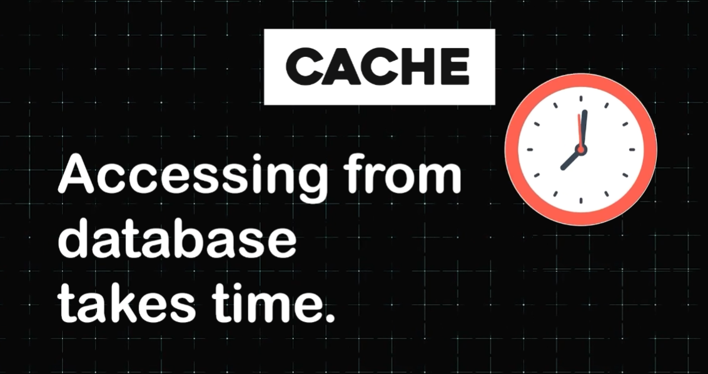
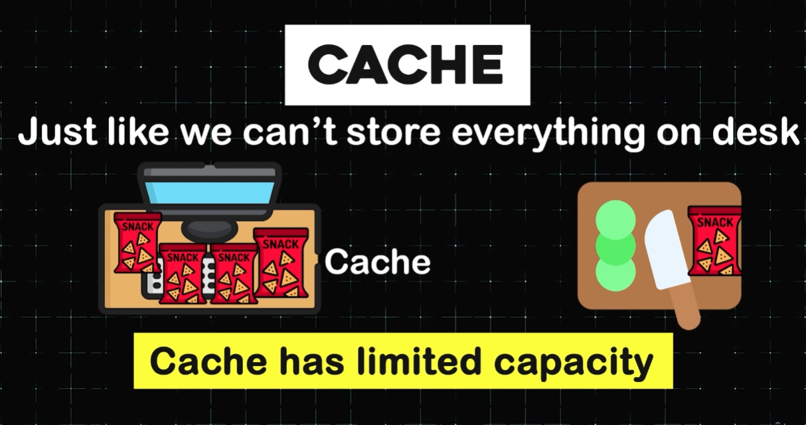
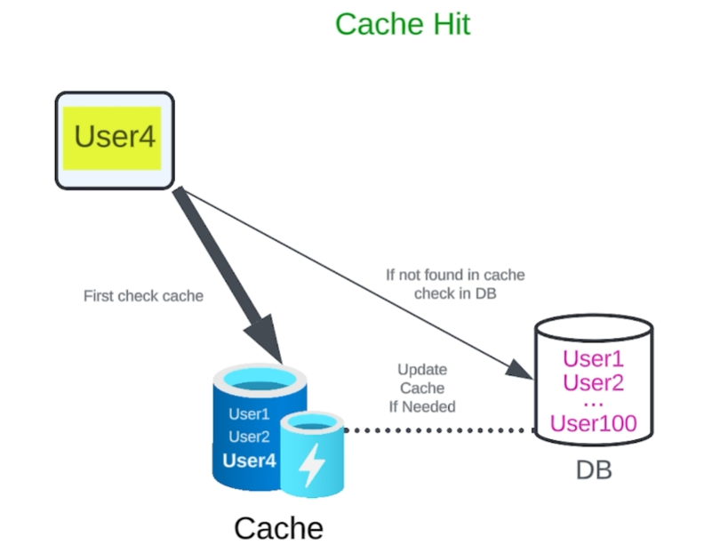

# Speeding Up Data Access with Caching ⚡

## **🧩 What is Caching?**

 
🔍 Accessing data directly from a database can be slow, but with caching, you can **speed things up significantly**.

---

### 🚀 Why Use Caching?
⚡ Think of caching as a **special kind of super-fast memory** where frequently accessed data is stored.

📊 Accessing data from a cache is **50 to 100 times faster** than fetching it from a database.

#### **Analogy**

🍪 It’s like keeping snacks on your desk while studying. Instead of walking to the kitchen (the database) every time you’re hungry, you simply grab a snack from your desk (the cache).

---

### 🎯 How Does Caching Work?

🔍 Caching stores only the **most frequently used data** because, just like your desk, it has **limited capacity** compared to a database.

#### **Cache Hit**

✅ When the requested data is found in the cache, it’s called a **cache hit**.
- **Example**: User 1 requests data, and the system finds it in the cache. The data is quickly fetched, making the process faster.

#### **Cache Miss**
❌ When the requested data is **not in the cache**, it’s called a **cache miss**.
- **Example**: User 4 requests data, but it’s not in the cache. The system fetches it from the database, which takes longer.
- **Bonus**: After retrieving the data, it’s added to the cache for faster access next time.

#### **Subsequent Cache Hit**
✅ When User 4 requests the same data again, it’s now in the cache, resulting in a **cache hit**. The data is fetched quickly, just like grabbing snacks from your desk.

---

### 🌍 Benefits of Caching
🛠️ Caching is a game-changer for improving system performance. Here’s why:

#### **Speed**
⚡ Caching reduces the time needed to access data, making your system **faster and more responsive**.

#### **Efficiency**
📊 By reducing the number of times you need to access the database, caching **saves resources** and improves overall efficiency.

#### **Scalability**
🌍 Caching helps handle **high traffic** by reducing the load on your database, making your system more scalable.

---

### 🧩 Where Can You Use Caching?
🔍 Caching can be implemented at **multiple layers** of your system:

#### **Database Layer**
📦 Cache frequently queried data to reduce database load.

#### **Server Layer**
🖥️ Cache responses from your server to speed up API requests.

#### **Client Layer**
📱 Cache data on the client side (e.g., browsers or mobile apps) to reduce server requests and improve user experience.

---

### 🏁 Summary: Why Caching Matters
📊 Caching is a **must-have** for modern systems. It:
- **Speeds up data access** by 50 to 100 times.
- **Reduces database load**, saving resources.
- **Improves scalability** by handling high traffic efficiently.

---

### 💡 Key Takeaway
🌱 Just like keeping snacks on your desk saves time, caching saves **time and resources** by keeping frequently accessed data close at hand.  
🚀 Whether you’re building a small app or a large-scale system, caching is a **simple yet powerful** way to optimize performance.

---

### 🎯 Final Thoughts
🔧 Caching is not just a technical detail—it’s a **strategic tool** for building fast, efficient, and scalable systems.  
🛠️ By understanding how caching works and where to use it, you can take your designs to the next level.

---

### ↩️ 🔙 [Back](../README.md)