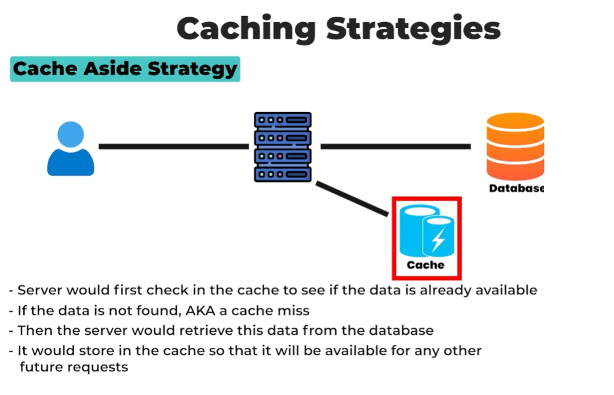
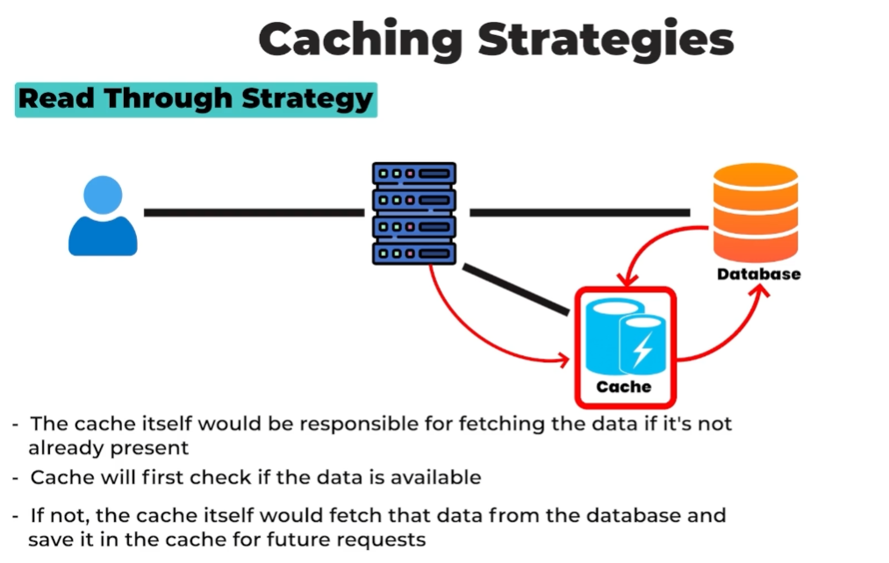
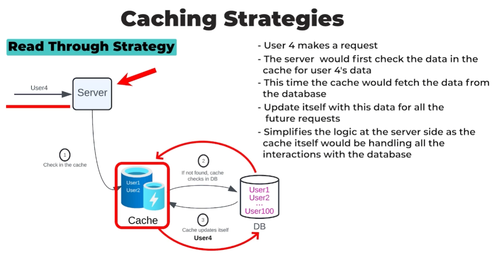
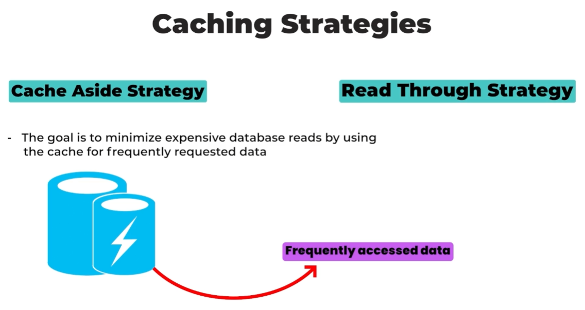

# Caching Strategies (Cache Aside vs. Read Through) 🗂️

---

## **Introduction** 🌟

Caching is a technique used to speed up data retrieval by storing frequently accessed data in a fast-access cache, rather than repeatedly querying a slower database. In this document, we will explore two common caching strategies: **Cache Aside** and **Read Through**.

---

### **1. Cache Aside Strategy** 🔄

#### **How It Works?** 🛠️

1. **✅ Step 1: Check the Cache**
    - When a data request is made, the server first checks if the data is already available in the cache.
    - If the data is present (**cache hit**), it is returned directly from the cache.

2. **❌➡️📂 Step 2: Cache Miss and Database Fetch**
    - If the data is **not** in the cache (**cache miss**), the server retrieves the data from the database.
    - After fetching the data, the server stores it in the cache for future requests.

3. **🔄📥 Step 3: Update the Cache**
    - The cache is updated with the data retrieved from the database, ensuring future requests can be served directly from the cache.

#### **Practical Example** 🖥️
- **Scenario:** A user (User 4) makes a request.

    1. The server checks the cache for User 4’s data.
    2. Since the data is not in the cache (**cache miss**), the server fetches it from the database.
    3. After retrieving the data, the server updates the cache for future requests.

#### **Advantages** 👍
- **Simplicity:** The server directly manages the cache logic.
- **Flexibility:** The cache can be updated or invalidated as needed.

---

### **2. Read Through Strategy** 📖➡️

#### **How It Works?** 🛠️

1. **✅ Step 1: Check the Cache**
    - When a data request is made, the server checks if the data is in the cache.

2. **❌➡️📂 Step 2: Cache Miss and Cache Fetches Data**
    - If the data is **not** in the cache (**cache miss**), the **cache itself** is responsible for fetching the data from the database.
    - The cache retrieves the data and stores it for future requests.

3. **🔄📥 Step 3: Cache Updates Itself**
    - The cache automatically updates itself with the retrieved data, simplifying the server-side logic.

#### **Practical Example** 🖥️

- **Scenario:** A user (User 4) makes a request.

    1. The server checks the cache for User 4’s data.
    2. Since the data is not in the cache (**cache miss**), the **cache** fetches it from the database.
    3. After retrieving the data, the cache updates itself for future requests.

#### **Advantages** 👍
- **Server Simplicity:** The server does not need to manage database fetch logic.
- **Consistency:** The cache automatically handles data updates.

---

### **Comparison: Cache Aside vs. Read Through** ⚖️

| **Aspect**            | **🔄 Cache Aside**                        | **📖➡️ Read Through**                   |
|------------------------|------------------------------------------|-----------------------------------------|
| **Responsibility**     | Server manages cache and database.       | Cache manages database fetching.        |
| **Complexity**         | More complex on the server side.         | Simpler on the server side.             |
| **Cache Update**       | Server updates the cache.                | Cache updates itself automatically.     |
| **Ideal Use Case**     | When server control is needed.           | When cache logic is centralized.        |

---

### **Conclusion** 🎯
Both strategies aim to **minimize expensive database reads** by using the cache for frequently requested data. The choice between **🔄 Cache Aside** and **📖➡️ Read Through** depends on the system architecture and the need for control over caching logic.

- **🔄 Cache Aside:** Ideal for scenarios where the server requires more control over the cache.
- **📖➡️ Read Through:** Ideal for simplifying server logic by centralizing cache management.

--- 

This document provides a clear and visually structured overview of caching strategies, making it easier to study and apply these concepts in real-world systems. 🚀

---

### **Additional Notes** 📝
- **🎯 Cache Hit:** Data is found in the cache.
- **❌ Cache Miss:** Data is not found in the cache, requiring a database fetch.
- **📂 Database Fetch:** Retrieving data from the database.
- **🔄 Cache Update:** Adding or refreshing data in the cache.

---

### ↩️ 🔙 [Back](../README.md)