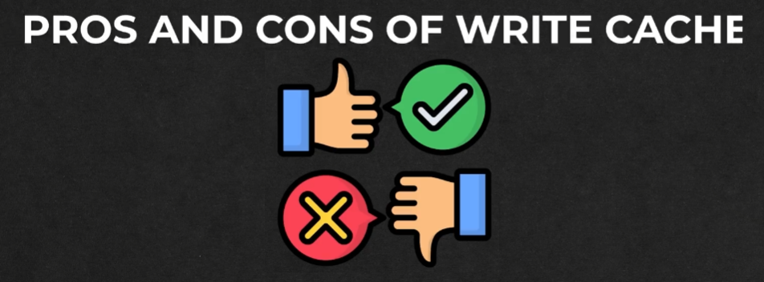
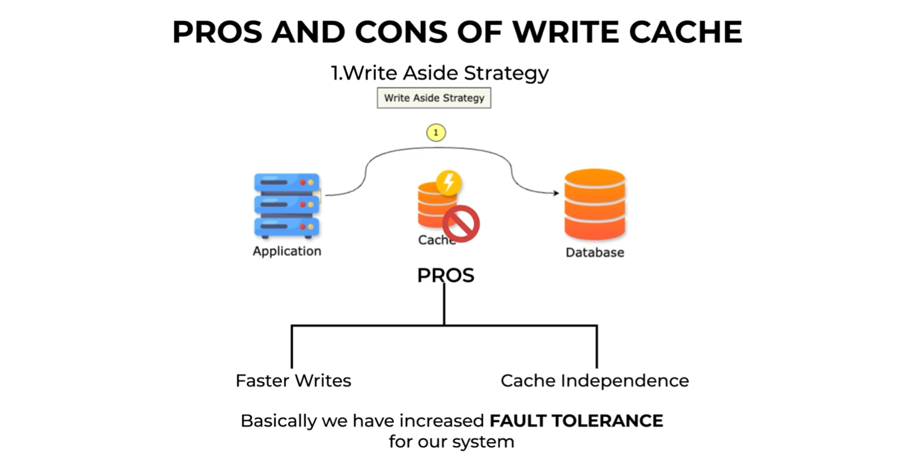
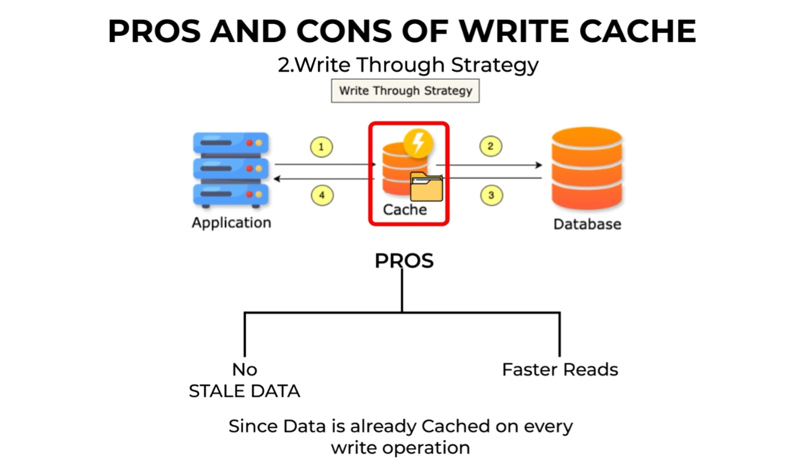
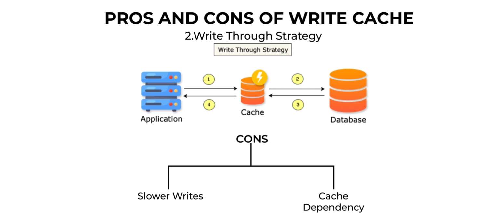

# Pros and Cons of Write Caching Strategies 📊

---

### 🌟 **Introduction**

In this document, we will explore the **pros and cons** of three widely used caching strategies: **Write-Around**, **Write-Through**, and **Write-Behind**. Understanding these strategies helps in making informed decisions about which approach to use based on system requirements and constraints.

---

### 🔄 **1. Write-Around Strategy (Direct Write to Database)** 🎯

#### 🛠️ **How It Works?**

1. **✅ Step 1: Write to Database**
   - Data is written directly to the database, bypassing the cache.

2. **❌➡️📂 Step 2: Cache Miss**
   - Since the cache is not updated during the write, subsequent reads may result in a **cache miss**.

3. **🔄📥 Step 3: Fetch from Database**
   - On a cache miss, data is fetched from the database and then stored in the cache for future reads.

---

#### 👍 **Pros of Write-Around Strategy**

1. **🎯 Faster Writes**
   - Since the cache is bypassed during writes, write operations are quicker.
   - *Example:* Ideal for write-heavy systems.

2. **📊 Cache Independence**
   - The cache is kept separate from the write process, ensuring that database writes continue even if the cache fails.
   - *Example:* Increases system fault tolerance.

---

#### 👎 **Cons of Write-Around Strategy**

1. **⚠️ Slower Reads**
   - Since the cache is bypassed during writes, data isn’t immediately available in the cache, leading to slower reads.
   - *Example:* Not ideal for query-heavy systems.

2. **📊 Risk of Stale Data**
   - If the cache already contains old data, it will continue serving it until the data expires or is invalidated.
   - *Example:* An updated user address in the database may not reflect in the cache immediately, causing inconsistencies.

---

### 📖➡️ **2. Write-Through Strategy (Write to Cache and Database Simultaneously)** 🔄

#### 🛠️ **How It Works?**

1. **✅ Step 1: Write to Cache and Database**
   - Data is written to both the cache and the database simultaneously.

2. **🔄📥 Step 2: Cache Confirmation**
   - The cache only confirms the write after receiving confirmation from the database.

---

#### 👍 **Pros of Write-Through Strategy**

1. **🎯 No Stale Data**
   - Since the cache and database are updated simultaneously, there’s no risk of inconsistencies.
   - *Example:* Ideal for systems requiring always-updated data.

2. **📊 Faster Reads**
   - Data is always available in the cache, speeding up read operations.
   - *Example:* Great for systems with heavy read operations.

---

#### 👎 **Cons of Write-Through Strategy**

1. **⚠️ Slower Writes**
   - Each write operation updates both the cache and the database, which can slow down the process.
   - *Example:* Not ideal for write-heavy systems.

2. **📊 Cache Dependency**
   - If the cache fails, writes to the database are also interrupted, potentially causing downtime.
   - *Example:* The cache becomes a critical point of failure.

---

### 🕒 **3. Write-Behind Strategy (Write to Cache and Update Database in the Background)**

#### 🛠️ **How It Works?**

1. **✅ Step 1: Write to Cache**
   - Data is written to the cache, which immediately sends a confirmation back to the application.

2. **🔄📥 Step 2: Asynchronous Database Update**
   - The database is updated asynchronously in the background.

---

#### 👍 **Pros of Write-Behind Strategy**

1. **🎯 Faster Writes**
   - The application receives confirmation as soon as the cache is updated, without waiting for the database.
   - *Example:* Ideal for systems requiring high write speeds.

2. **📊 Faster Reads**
   - Since data is always in the cache, read operations are quick and efficient.
   - *Example:* Combines the best of both worlds: fast writes and reads.

---

#### 👎 **Cons of Write-Behind Strategy**

1. **⚠️ Risk of Data Loss**
   - If the asynchronous database update fails, data may be lost since the cache is temporary.
   - *Example:* Durability issues can arise in case of failures.

2. **📊 Cache Dependency**
   - Like the Write-Through strategy, the cache is a critical component. If it fails, writes to the database are halted.
   - *Example:* Can lead to system downtime if the cache fails.

---

### ⚖️ **Comparison: Write-Around vs. Write-Through vs. Write-Behind**

| **Aspect**                | **🎯 Write-Around**                      | **🔄 Write-Through**                   | **🕒 Write-Behind**                   |
|---------------------------|------------------------------------------|-----------------------------------------|-----------------------------------------|
| **Write Speed**            | Fast                                     | Slow                                    | Fast                                    |
| **Read Speed**             | Slow                                     | Fast                                    | Fast                                    |
| **Data Consistency**       | Stale data possible                      | Always fresh                            | Risk of data loss                       |
| **Cache Dependency**       | Low                                      | High                                    | High                                    |
| **Fault Tolerance**        | High (cache failure doesn’t affect writes) | Low (cache failure affects writes)      | Low (cache failure affects writes)      |

---

### 🎯 **Conclusion**

Each strategy has its place depending on your system’s needs:
- **Write-Around:** Fast writes, but slower reads and stale data risks. 🐢⏳
- **Write-Through:** Always updated data, but slower writes and cache dependency. ✅⚠️
- **Write-Behind:** Fast writes and reads, but risks of data loss and cache dependency. ⚡🚨

Choose the one that best fits your scenario! 🚀✨

---

### 📝 **Additional Notes**
- **🎯 Cache Hit:** Data is found in the cache.
- **❌ Cache Miss:** Data is not found in the cache, requiring a database fetch.
- **🔄 Cache Invalidation:** Process of removing stale data from the cache.
- **📂 Write Through Strategy:** Ensures cache and database are updated simultaneously during writes.

--- 

### ↩️ 🔙 [Back](../README.md)