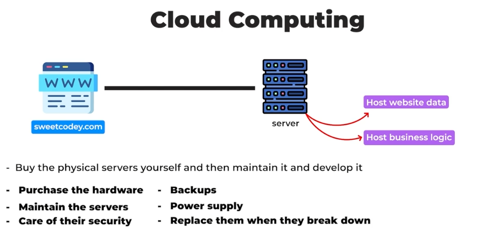
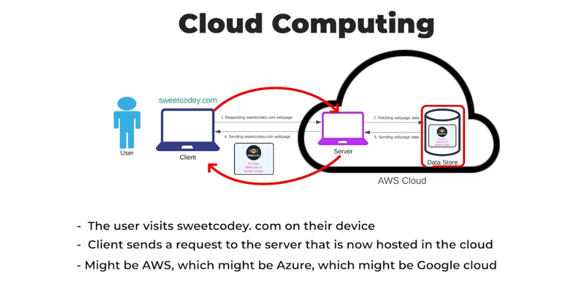

# Boosting Website Speed with CDNs ☁️

---

### **🌥️ What is the "cloud"?**

Many people think the "cloud" is a magical place where data floats. 🪄✨  
Here’s the truth: **there’s no physical "cloud."**  
All cloud computing happens on **physical servers** located in **data centers** around the world. 🖥️🏢

---

### **🤔 So, what is cloud computing?**

Let’s break it down with an example:  
Imagine you want to create a website like **Sweet Quora.com**. To host your site, you need servers. These servers store your website’s data and run your business logic.

Here’s the challenge:

- You could **buy physical servers** and maintain them.
- But that’s **expensive** and **time-consuming**. 💸⏳
    - You’d need to buy hardware, maintain the servers, handle security, backups, power supply, and replace them when they break.

---

### **🛠️ How does cloud computing help?**

Instead of buying and maintaining servers, you can **rent them** from companies like **Amazon (AWS)**, **Google (Google Cloud)**, or **Microsoft (Azure)**. 🏢🔧

These companies have **huge data centers** filled with ready-to-use servers. So, how does it work?

1. A user visits **Sweet Quora.com** on their device. 📱💻
2. The client sends a request to the server hosted in the cloud (AWS, Azure, Google Cloud). ☁️➡️🖥️
3. The server fetches the data from storage. 📂
4. The server sends the webpage back to the user’s device. 🖥️➡️📱

All of this is **rented** from cloud providers!

---

### **💡 Fun Fact: The origin of AWS**

Did you know **AWS (Amazon Web Services)** started as an experiment? 🧪  
Amazon originally built AWS to handle its own retail business but realized it could rent out this infrastructure to others. Today, AWS is the largest cloud provider in the world! 🌍🏆

---

### **✅ Benefits of cloud computing**

1. **📈 Scalability**
    - Instantly increase or decrease server capacity.
    - No need to buy new servers when your site grows.

2. **💰 Cost-effectiveness**
    - Pay only for the resources you use.
    - During low traffic periods, you can reduce resources.

3. **🛡️ Reliability**
    - Big companies handle maintenance, security, and backups.
    - Far more reliable than managing physical servers on your own.

---

### **🚀 Digital transformation**

Cloud computing has changed how websites and apps are hosted. Instead of worrying about hardware, you can focus on **building your business**. Meanwhile, providers like **AWS, Azure, and GCP** handle all the infrastructure. 🏗️👷

--- 

**📌 Summary:**
- The "cloud" isn’t magic—it’s physical servers.
- Renting servers from big companies is cheaper and more efficient.
- Scalability, cost-effectiveness, and reliability are the biggest benefits.

---
### ↩️ 🔙 [Back](../README.md)